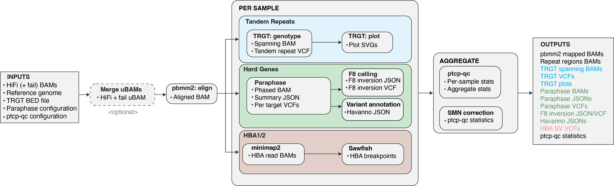

<h1 align="center"></h1>

<h1 align="center">PacBio PureTarget Carrier Pipeline</h1>

The PacBio PureTarget Carrier Pipeline is a WDL-based workflow designed to genotype tandem repeat regions and homologous genes with segmental duplications using PacBio PureTarget data. It orchestrates several established PacBio tools in a containerized environment to deliver reproducible, per-sample and multi-sample results.

## Version information

Current version: **3.1.2** (released 2025-10-03).

For a complete changelog, see the [changelog](CHANGELOG.md) or the git history.

## Support

For frequently asked questions, please refer to the [FAQ section](docs/FAQ.md). For questions about running PTCP on DNAnexus, please see the [PTCP on DNAnexus page](docs/PTCP_on_DNAnexus.md).

If you have questions or issues running PTCP on your local system, you can contact PacBio support at [support@pacb.com](mailto:support@pacb.com?subject=PureTarget%20Carrier%20Pipeline). Please ensure **PureTarget Carrier Pipeline** is in the subject line.

## Table of contents

1. [Workflow overview](#1-workflow-overview)
2. [Running PTCP](#2-running-ptcp)
    - 2.1. [PTCP on HPC](#21-ptcp-on-hpc)
    - 2.2. [PTCP on DNAnexus](#22-ptcp-on-dnanexus)
3. [Inputs and configuration](#3-inputs-and-configuration)
4. [Workflow outputs](#4-workflow-outputs)
5. [DISCLAIMER](#5-disclaimer)

## 1. Workflow overview

|  |
| :---: |
| **PTCP workflow overview**: The pipeline processes genomic data through modules running in parallel per sample, followed by aggregate quality control and correction steps. |

Upon invocation, PTCP processes each sample independently:

1. **Alignment ([pbmm2](https://github.com/PacificBiosciences/pbmm2))**: Aligns HiFi (and optional fail) reads to the reference genome.
2. **Tandem repeat genotyping ([TRGT](https://github.com/PacificBiosciences/trgt))**: Generates per-sample VCFs containing genotypes for all targeted regions, spanning BAMs of reads used for genotyping, per-locus plots (motif and waterfall), and extracts reads (including optional fail reads) overlapping the specified tandem repeat loci.
3. **Gene phasing & analysis ([Paraphase](https://github.com/PacificBiosciences/paraphase))**: Reads are phased within configured gene families; copy number is estimated, (small) variants are called for each haplotype, and optionally annotated with known variants.
4. **Structural variation calling ([Sawfish](https://github.com/PacificBiosciences/sawfish))**: Aligned reads for configured genes are extracted, realigned, (large) structural variations are called, and reported in per-sample VCFs.
5. **QC reporting ([ptcp-qc](https://github.com/PacificBiosciences/ptcp-qc))**: Aggregates coverage, mapping quality, and genotyping metrics into both sample-level and cohort-level JSON reports for comprehensive quality control.

## 2. Running PTCP

PTCP is available to run locally on a high-performance computing (HPC) system or in the cloud with DNAnexus. Details for both options are provided below:

### 2.1 PTCP on HPC

Running PTCP on an HPC system is possible with some configuration. For instructions on setting up the pipeline on your HPC system, please see the [PTCP on HPC page](docs/PTCP_on_HPC.md).

### 2.2 PTCP on DNAnexus

PTCP has been integrated into the DNAnexus platform. For instructions on getting set up there and running the pipeline, please see the [PTCP DNAnexus page](docs/PTCP_on_DNAnexus.md).

## 3. Inputs and configuration

PTCP requires six primary input types, all specified in a JSON file:

1. PacBio sequencing data (`.bam`)
2. Sample sheet (`.csv`)
3. Reference genome (`.fa` and `.fai`)
4. Regions and annotations (`.bed` and `.vcf`)
5. Configuration file (`.yaml`)
6. PTCP dependencies image (a local `.sif` or Docker image)

In practice, only the sequencing data and sample sheet typically change between runs. The other inputs (3–6) are typically set up once when installing the pipeline and remain the same for future runs.

Details on each of these input types and how to generate them can be found on the [Input Files page](docs/Input_files.md).

## 4. Workflow outputs

PTCP generates many output files per sample in the selected output folder. More details on the output files and their formats can be found on the [Output Files page](docs/Output_files.md).

## 5. DISCLAIMER

THIS WEBSITE AND CONTENT AND ALL SITE-RELATED SERVICES, INCLUDING ANY DATA, ARE
PROVIDED "AS IS," WITH ALL FAULTS, WITH NO REPRESENTATIONS OR WARRANTIES OF ANY
KIND, EITHER EXPRESS OR IMPLIED, INCLUDING, BUT NOT LIMITED TO, ANY WARRANTIES
OF MERCHANTABILITY, SATISFACTORY QUALITY, NON-INFRINGEMENT OR FITNESS FOR A
PARTICULAR PURPOSE. YOU ASSUME TOTAL RESPONSIBILITY AND RISK FOR YOUR USE OF THIS
SITE, ALL SITE-RELATED SERVICES, AND ANY THIRD PARTY WEBSITES OR APPLICATIONS. NO
ORAL OR WRITTEN INFORMATION OR ADVICE SHALL CREATE A WARRANTY OF ANY KIND. ANY
REFERENCES TO SPECIFIC PRODUCTS OR SERVICES ON THE WEBSITES DO NOT CONSTITUTE OR
IMPLY A RECOMMENDATION OR ENDORSEMENT BY PACIFIC BIOSCIENCES.