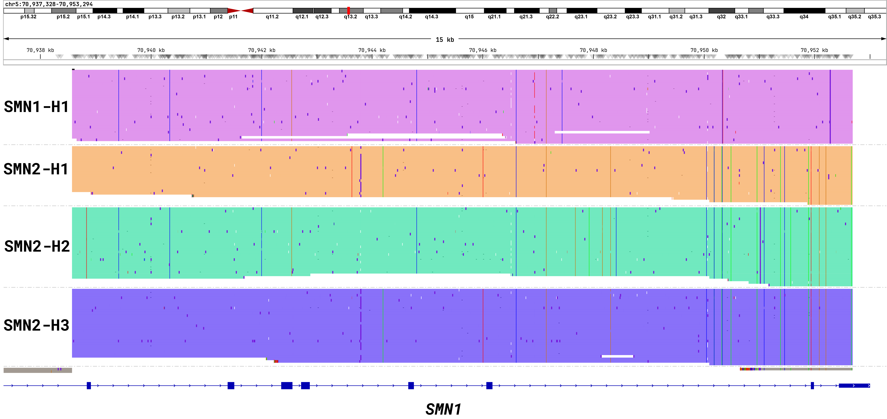
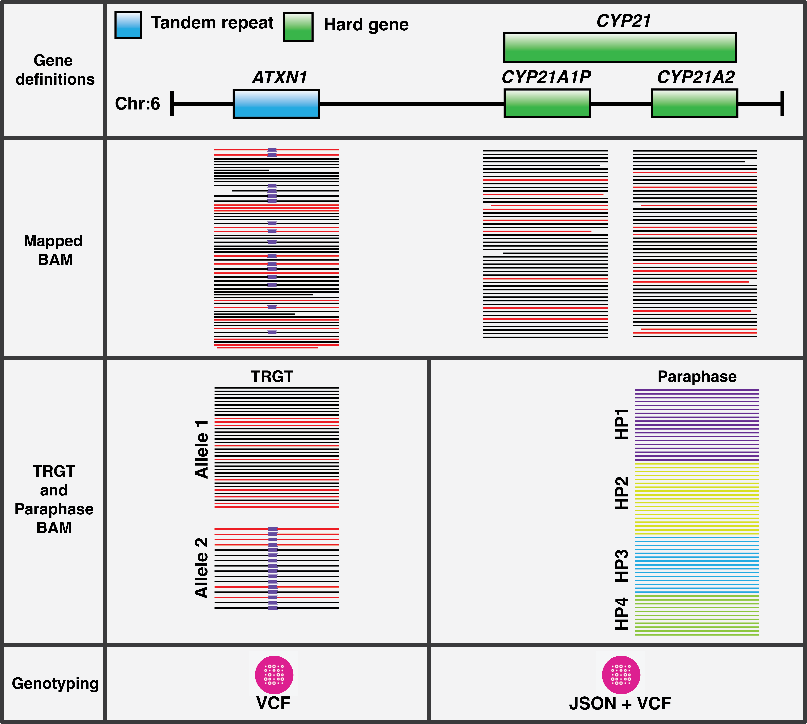

# Output file definitions and descriptions

PTCP generates a comprehensive set of output files for each sample, providing analysis results across multiple analysis domains. The workflow produces files for tandem repeat analysis, gene phasing, structural variant detection, and quality control metrics.

## Table of contents

1. [Output definitions table](#1-output-definitions-table)
2. [Example outputs.json](#2-example-outputsjson)
3. [Output file descriptions](#3-output-file-descriptions)
    - 3.1. [Sample information](#31-sample-information)
    - 3.2. [Reference genome alignment (pbmm2)](#32-reference-genome-alignment-pbmm2)
    - 3.3. [Tandem repeat analysis (TRGT)](#33-tandem-repeat-analysis-trgt)
    - 3.4. [Gene phasing (Paraphase)](#34-gene-phasing-paraphase)
    - 3.5. [Variant annotation (havanno)](#35-variant-annotation-havanno)
    - 3.6. [F8 inversion analysis](#36-f8-inversion-analysis)
    - 3.7. [Structural variant detection (Sawfish)](#37-structural-variant-detection-sawfish)
    - 3.8. [Quality control (ptcp-qc)](#38-quality-control-ptcp-qc)

## 1. Output definitions table

| Name                            | Type                 | Description                                                                                          | Notes                                                                              |
| ------------------------------- | -------------------- | ---------------------------------------------------------------------------------------------------- | ---------------------------------------------------------------------------------- |
| `sample_names`                  | `Array[String]`      | Sample names, in same order as other arrays                                                          |                                                                                    |
| `mapped_bam`                    | `Array[File]`        | BAM with reference genome alignments                                                                 | [details](https://github.com/PacificBiosciences/pbmm2)                             |
| `mapped_bam_bai`                | `Array[File]`        | BAI index for above                                                                                      |                                                                                    |
| `trgt_vcf`                      | `Array[File]`        | VCF of tandem repeat genotypes                                                                       | [details](https://github.com/PacificBiosciences/trgt/blob/main/docs/vcf_files.md)  |
| `trgt_spanning_bam`             | `Array[File]`        | BAM of clipped spanning reads overlapping repeat regions                                             |                                                                                    |
| `trgt_spanning_bam_bai`         | `Array[File]`        | BAI index for above                                                                                      |                                                                                    |
| `images_motifs_allele`          | `Array[File]`        | Zip of per-region images                                                                             | [details](https://github.com/PacificBiosciences/trgt/blob/main/docs/trvz-plots.md) |
| `images_meth_allele`            | `Array[File]`        | Zip of per-region images                                                                             | [details](https://github.com/PacificBiosciences/trgt/blob/main/docs/trvz-plots.md) |
| `images_motifs_waterfall`       | `Array[File]`        | Zip of per-region images                                                                             | [details](https://github.com/PacificBiosciences/trgt/blob/main/docs/trvz-plots.md) |
| `images_meth_waterfall`         | `Array[File]`        | Zip of per-region images                                                                             | [details](https://github.com/PacificBiosciences/trgt/blob/main/docs/trvz-plots.md) |
| `reads_overlapping_repeats`     | `Array[File]`        | BAM of reads overlapping repeat regions                                                              |                                                                                    |
| `reads_overlapping_repeats_bai` | `Array[File]`        | BAI index for above                                                                                      |                                                                                    |
| `paraphase_bam`                 | `Array[File]`        | BAM of reads phased by Paraphase, all haplotypes are aligned against the main gene of interest       |                                                                                    |
| `paraphase_bam_bai`             | `Array[File]`        | BAI index for above                                                                                      |                                                                                    |
| `paraphase_json`                | `Array[File]`        | JSON that summarizes haplotypes and variant calls for each gene family in each sample                |                                                                                    |
| `paraphase_vcfs`                | `Array[Array[File]]` | VCFs of small variants, a VCF file is written for each region (gene family)                          | [details](https://github.com/PacificBiosciences/paraphase/blob/main/docs/vcf.md)   |
| `havanno_json`                  | `Array[File?]`       | JSON file annotating Paraphase output with variants of interest (present only if havanno is enabled)                                      | [details](../docker/ptcp/scripts/havanno/README.md)                                   |
| `f8_vcf`                        | `Array[File]`        | VCF of *F8* inversion calls                                                                          |                                                                                    |
| `f8_json`                       | `Array[File]`        | JSON of evidence for *F8* inversion calls                                                            |                                                                                    |
| `sawfish_minimap2_bam`          | `Array[File]`        | BAM of reads aligned with minimap2 used by Sawfish (this only includes reads in ~80 kb window on *HBA*) |                                                                                   |
| `sawfish_minimap2_bam_bai`      | `Array[File]`        | BAI index for above                                                                                      |                                                                                    |
| `sawfish_vcf`                   | `Array[File]`        | Bgzipped VCF of SVs called by Sawfish                                                                         |                                                                                    |
| `sawfish_vcf_tbi`               | `Array[File]`        | Tabix index for above                                                                                      |                                                                                    |
| `ptcp_qc_reports`               | `Array[File]`        | JSONs of ptcp-qc per sample and aggregate reports                                                    |                                                                                    |
| `ptcp_qc_csv_reports`           | `Array[File]`        | CSV summaries of ptcp-qc reports (coverage, trgt, paraphase, aggregate when available)               |                                                                                    |

## 2. Example outputs.json

Here's an example of what the workflow outputs look like for the Coriell sample **HG00281**:

```json
{
  "ptcp.sample_names": ["HG00281"],
  "ptcp.mapped_bam": ["ptcp/out/HG00281.mapped.bam"],
  "ptcp.mapped_bam_bai": ["ptcp/out/HG00281.mapped.bam.bai"],
  "ptcp.trgt_vcf": ["ptcp/out/HG00281.trgt.vcf"],
  "ptcp.trgt_spanning_bam": ["ptcp/out/HG00281.trgt.sorted.spanning.bam"],
  "ptcp.trgt_spanning_bam_bai": ["ptcp/out/HG00281.trgt.sorted.spanning.bam.bai"],
  "ptcp.images_meth_allele": ["ptcp/out/HG00281.meth_allele.trgt_plots.zip"],
  "ptcp.images_meth_waterfall": ["ptcp/out/HG00281.meth_waterfall.trgt_plots.zip"],
  "ptcp.images_motifs_allele": ["ptcp/out/HG00281.motifs_allele.trgt_plots.zip"],
  "ptcp.images_motifs_waterfall": ["ptcp/out/HG00281.motifs_waterfall.trgt_plots.zip"],
  "ptcp.reads_overlapping_repeats": ["ptcp/out/HG00281.repeats.bam"],
  "ptcp.reads_overlapping_repeats_bai": ["ptcp/out/HG00281.repeats.bam.bai"],
  "ptcp.paraphase_bam": ["ptcp/out/HG00281_paraphase/HG00281.paraphase.bam"],
  "ptcp.paraphase_bam_bai": ["ptcp/out/HG00281_paraphase/HG00281.paraphase.bam.bai"],
  "ptcp.paraphase_json": ["ptcp/out/HG00281_paraphase/HG00281.paraphase.json"],
  "ptcp.paraphase_vcfs": [
    [
      "ptcp/out/HG00281_paraphase/HG00281_paraphase_vcfs/HG00281_cyp21.vcf",
      "ptcp/out/HG00281_paraphase/HG00281_paraphase_vcfs/HG00281_f8inv1.vcf",
      "ptcp/out/HG00281_paraphase/HG00281_paraphase_vcfs/HG00281_f8inv22.vcf",
      "ptcp/out/HG00281_paraphase/HG00281_paraphase_vcfs/HG00281_gba.vcf",
      "ptcp/out/HG00281_paraphase/HG00281_paraphase_vcfs/HG00281_hba.vcf",
      "ptcp/out/HG00281_paraphase/HG00281_paraphase_vcfs/HG00281_hbb.vcf",
      "ptcp/out/HG00281_paraphase/HG00281_paraphase_vcfs/HG00281_rpgr.vcf",
      "ptcp/out/HG00281_paraphase/HG00281_paraphase_vcfs/HG00281_smn1.vcf"
    ]
  ],
  "ptcp.havanno_json": ["ptcp/out/HG00281.havanno.json"],
  "ptcp.f8_json": ["ptcp/out/HG00281.f8inversion.json"],
  "ptcp.f8_vcf": ["ptcp/out/HG00281.f8inversion.vcf"],
  "ptcp.sawfish_minimap2_bam": ["ptcp/out/HG00281.minimap2.bam"],
  "ptcp.sawfish_minimap2_bam_bai": ["ptcp/out/HG00281.minimap2.bam.bai"],
  "ptcp.sawfish_vcf": ["ptcp/out/HG00281_sawfish/HG00281.sv.vcf.gz"],
  "ptcp.sawfish_vcf_tbi": ["ptcp/out/HG00281_sawfish/HG00281.sv.vcf.gz.tbi"],
  "ptcp.ptcp_qc_reports": ["ptcp/out/ptcp_qc/qc.HG00281.json", "ptcp/out/ptcp_qc/qc.aggregate.json"],
  "ptcp.ptcp_qc_csv_reports": [
    "ptcp/out/ptcp_qc/qc.trgt.csv",
    "ptcp/out/ptcp_qc/qc.paraphase.csv",
    "ptcp/out/ptcp_qc/qc.coverage.csv",
    "ptcp/out/ptcp_qc/qc.aggregate.csv"
  ]
}
```

## 3. Output file descriptions

The following sections provide detailed descriptions of each output type. Some outputs are self-explanatory (such as index files), while others contain analysis results that require more in-depth explanation, this will primarily be in context of sample **HG00281**, with some exceptions to highlight specific outputs.

### 3.1. Sample information
- **`sample_names`** (`Array[String]`): Contains the sample identifiers in the same order as all other output arrays. This ensures you can correlate outputs with the correct sample.

### 3.2. Reference genome alignment (pbmm2)
- **`mapped_bam`** (`Array[File]`): BAM files containing HiFi (+fail) reads aligned to the reference genome using [pbmm2](https://github.com/PacificBiosciences/pbmm2). These files serve as the foundation for all downstream analyses and contain the primary alignment information for each sample.

- **`mapped_bam_bai`** (`Array[File]`): BAI index files for the mapped BAM files, enabling efficient random access to specific genomic regions during analysis.

### 3.3. Tandem repeat analysis (TRGT)
- **`trgt_vcf`** (`Array[File]`): VCF files containing tandem repeat genotype calls generated by [TRGT](https://github.com/PacificBiosciences/trgt). These files include repeat length estimates, motif sequences, and quality metrics for each targeted repeat region.

The TRGT VCF file provides an analysis-ready summary of each genotyped repeat defined in the input catalog. TRGT outputs complete inferred allele sequences (with a leading padding base for VCF compliance) along with sample-level annotations capturing length, composition, support, purity, and methylation data.

Each genotyped locus contains the following standardized fields:

- INFO fields
  - `TRID` — Unique repeat/locus identifier from the catalog
  - `END` — End coordinate of the locus
  - `MOTIFS` — Comma-separated list of motif units used at this locus
  - `STRUC` — (deprecated) Expected locus structure (e.g., `(TTTTA)n(TTTCA)n(TTTTA)n`)

- FORMAT fields (per sample)
  - `GT` — Standard genotype
  - `AL` — Allele lengths in base pairs (one value per allele)
  - `ALLR` — Allele length confidence intervals in "low-high" format per allele
  - `SD` — Supporting read depth (read count) per allele
  - `MC` — Comma-separated motif counts per allele; within an allele, counts for multiple motifs are joined by `_` in the order listed in `MOTIFS` (e.g., with `MOTIFS=A,AC`, `MC=18_0,20_1` means allele1 has 18xA and 0xAC; allele2 has 20xA and 1xAC)
  - `MS` — Per-allele run-length segmentation as `<motifIndex>(start-end)` blocks in 0-based, half-open coordinates on the allele sequence; blocks are joined by `_`.
  - `AP` — Allele purity (fraction of bases matching expected motifs) per allele
  - `AM` — Allele methylation (mean 5mCpG level across the repeat region) per allele

Consider this *AFF2* locus record from sample **HG00281**:

```
chrX	148500604	.	TGCCGCGGCCGCCGCCGCCGCCTGTGCAGCCGCTGCCGCCGCCGCCGCCGCCGCCGCCGCCGCCGCCGCCGCCGCCGCCGCTGCCGCCCCGGCTGCCGCGCCGCGCCGCTGCCTCTGCCCCGGCCGCCCCCGCCGCCGCTGCCGCCGCCG	TGCCGCGGCCGCCGCCGCCGCCTGTGCAGCCGCTGCCGCCGCCGCCGCCGCCGCCGCCGCCGCCGCCGCCGCCGCTGCCGCCCCGGCTGCCGCGCCGCGCCGCTGCCTCTGCCCCGGCCGCCCCCGCCGCCGCTGCCGCCGCCG,TGCCGCGGCCGCCGCCGCCGCCTGTGCAGCCGCTGCCGCCGCCGCCGCCGCCGCCGCCGCCGCCGCCGCCGCCGCCGCCGCCGCCGCCGCCGCCGCCGCTGCCGCCCCGGCTGCCGCGCCGCGCCGCTGCCTCTGCCCCGGCCGCCCCCGCCGCCGCTGCCGCCGCCG	.	.	TRID=FRAXE_AFF2;END=148500753;MOTIFS=GCC;STRUC=<TR>	GT:AL:ALLR:SD:MC:MS:AP:AM	1/2:143,167:140-149,160-176:302,312:34,42:0(0-3)_0(6-21)_0(27-30)_0(33-72)_0(75-81)_0(87-90)_0(92-95)_0(97-100)_0(103-106)_0(109-112)_0(115-121)_0(124-130)_0(133-142),0(0-3)_0(6-21)_0(27-30)_0(33-96)_0(99-105)_0(111-114)_0(116-119)_0(121-124)_0(127-130)_0(133-136)_0(139-145)_0(148-154)_0(157-166):0.857143,0.877193:0.10,0.76
```

The VCF record spans **chrX:148,500,604–148,500,753** at the locus *FRAXE_AFF2*, which has a repeat motif set of `MOTIFS=GCC`. The genotype is `GT=1/2`, indicating that both alleles are non-reference and correspond to the two alternate alleles (the long reference allele is listed as REF but is not carried in this sample).

TRGT reports the following FORMAT fields for the two alleles:

| FORMAT field             | Allele 1     | Allele 2     |
| ------------------------ | ------------ | ------------ |
| Allele length (`AL`)     | 143 bp       | 167 bp       |
| Length CI (`ALLR`)       | 140–149 bp   | 160–176 bp   |
| Read support (`SD`)      | 302 reads    | 312 reads    |
| Motif count (`MC`)       | 34 GCC units | 42 GCC units |
| Purity score (`AP`)      | 85.7%        | 87.7%        |
| Methylation level (`AM`) | 0.10 (10%)   | 0.76 (76%)   |

The motif counts (`MC=34,42`) correspond to 34 and 42 copies of the GCC unit, which translate to 102 bp and 126 bp of motif sequence. Comparing these values to the total allele lengths shows that both alleles share ~41 bp of non-motif sequence, while the longer allele carries eight additional GCC repeats (24 bp), explaining the difference between 143 and 167 bp. The segmentation string (`MS`) makes this structure explicit, with each block (e.g. 0(33-72)) marking a run of GCC units and gaps corresponding to interruptions or non-motif sequence. The purity values (`AP=0.857,0.877`) indicate that roughly 86–88% of each allele consists of motif sequence, consistent with clean, motif-rich repeats. Methylation levels (`AM=0.10,0.76`) show that the shorter allele is largely unmethylated, whereas the longer expanded allele is heavily methylated. Briefly, *AFF2* in **HG00281** is heterozygous for two non-reference alleles that differ by eight GCC copies, share the same amount of non-motif sequence, and show contrasting epigenetic signatures.

- **`trgt_spanning_bam`** (`Array[File]`): BAM files containing reads that span across tandem repeat regions.

The TRGT *spanning BAM* contains only the reads used for genotyping at each targeted locus, trimmed to the repeat plus 50 bp of flanking sequence (default, configurable in TRGT). These BAMs are intended for close inspection (e.g., in IGV) and for downstream tooling such as TRGT plotting. Unlike the broader `reads_overlapping_repeats` BAM, they carry per-read annotations that link each read back to the locus and allele inferred by TRGT. Among these are the `TR` tag, which identifies the locus, and the `AL` tag, which records the allele assignment (`0` for the shorter allele, `1` for the longer).  Note that the `trgt_spanning_bam` is always a strict subset of reads from either `reads_overlapping_repeats` or the original `mapped_bam`, filtered to retain only those that fully span the locus. Because each read carries its `TR` tag, the BAM can be easily filtered for specific loci of interest.

As an example, consider the two reads below from the *AFF2* locus in HG00281, which correspond to alleles 0 and 1, respectively:

```sam
m84036_250311_030304_s2/266931111/ccs	0	chrX	148500554	60	21=1D62=9D157=	chr1	1	0	CTTCTAGCTGTCCAGGCTCCGCCCCTGTGAGTGTGTAAGTGTGTGATGCTGCCGCGGCCGCCGCCGCCGCCTGTGCAGCCGCTGCCGCCGCCGCCGCCGCCGCCGCCGCCGCCGCCGCCGCTGCCGCCCCGGCTGCCGCGCCGCGCCGCTGCCTCTGCCCCGGCCGCCCCCGCCGCCGCTGCCGCCGCCGGCCCGCAGCCAGCCAGGCGGGCGGCCCAGCCCGCCTGAGCCCGCAGCGGC	IIIIIIIIIIIIIIIIIIIIIIIIIIIIIIIIIIIIIIIIIIIIIIIIIIIIIIIIIIIIIIIIIIIIIIIIIIIIIIIIIIIIIIIIIIIIIIIIIIIIIIIIIIIIIIIIIIIIIIIIIIIIIIIIIIIIIIIIIIIIIIIIIIIIIIIIIIIIIDIIIIIIIIIIIIIIIIIIIIIIIIIIIIIIIIIIIIIIIIIIIIIIIIIIIIIIIIIIIIIIIIIIIIIIIIIIIIIIIIII	TR:Z:FRAXE_AFF2	rq:f:0.999924	MC:B:C,0,0,0,0,0,0,0,0,0,0,0,0,0,0,0,0,0,0,0,0,0,0,0,0,0,0,0,0,0,0,0,0,0,0,0,0,0,0,0,0,0	MO:B:i,-959,-655,1684	SO:i:-1880	EO:i:1975	AL:i:0	FL:B:I,50,50

m84036_250311_030304_s2/236786469/ccs	0	chrX	148500554	60	21=1D62=18I166=	chr1	1	0	CTTCTAGCTGTCCAGGCTCCGCCCCTGTGAGTGTGTAAGTGTGTGATGCTGCCGCGGCCGCCGCCGCCGCCTGTGCAGCCGCTGCCGCCGCCGCCGCCGCCGCCGCCGCCGCCGCCGCCGCCGCCGCCGCCGCCGCCGCCGCCGCCGCTGCCGCCCCGGCTGCCGCGCCGCGCCGCTGCCTCTGCCCCGGCCGCCCCCGCCGCCGCTGCCGCCGCCGGCCCGCAGCCAGCCAGGCGGGCGGCCCAGCCCGCCTGAGCCCGCAGCGGC	IIIIIIIIIIIDIIIIIIIII+IIIIIIIIIIIIIIIIIIIIIIIIIIIIIIIIIIIIIIIIIIIIIIIIIIIIIIIIIIIIIIIII<IIIIIDIIDII<IIDIIIIIIIIDIDIIIIIIIIIIIIIIIIIIIIIIIIIIIIIIDIIIIIIIIDIIIIIIIIDIIIIDIIIIDIIIIIIIIIIIIIII7IIII+IIIIIIIIIIIIIIIIIIIDDIDIIIIIIIIDIIIIIIIIIDIIIIIIIIIIIIIIIIIIII+IIIIIIIDII	TR:Z:FRAXE_AFF2	rq:f:0.999666	MC:B:C,255,255,255,254,250,251,202,123,120,246,252,240,165,213,244,244,245,253,255,255,255,255,255,255,253,251,249,252,252,250,234,220,234,254,196,53,42,209,206,209,200,244,255,255,255,255,255,254,254,237	MO:B:i,-1673,-1094,-1055,-876,1684	SO:i:-1880	EO:i:1975	AL:i:1	FL:B:I,50,50
```
Each SAM record in a spanning BAM follows the standard SAM format, but includes additional TRGT- and PacBio-specific tags:

- **SAM fields:** QNAME/FLAG/RNAME/POS/MAPQ/CIGAR/SEQ/QUAL—interpret as usual, see the [SAM specification](https://samtools.github.io/hts-specs/) for more details.
- **Tags of interest:**  
  `TR:Z` — Unique repeat/locus identifier from the catalog
  `AL:i` — Allele assignment (0 = short, 1 = long; haploid loci may only have 0)
  `SO:i` — Start offset of the read relative to the locus start (negative = upstream of locus start)
  `EO:i` — End offset of the read relative to the locus end (positive = downstream of locus end)
  `MO:B:i` — Mismatch offsets upstream or downstream relative to the locus (useful for spotting mismatches) 
  `FL:B:I` — Left/right flank lengths included with the repeat (typically 50,50 by default)
  `MC:B:C` — Methylation encoding
  `rq:f` — Predicted read accuracy

The primary use case for the spanning BAM is visualization and QC. You can either use it with TRGT’s plotting tool to generate allele and waterfall plots with motif or methylation coloring, or load it into IGV to inspect allele assignments, interruptions, and per-allele methylation patterns. For example, loading the spanning BAM of **HG00281** and viewing *AFF2* reveals one contracted and one expanded allele relative to the reference genome:

|  |
| :---: |
| IGV view of the *AFF2* locus in **HG00281** (downsampled coverage). Reads are grouped and colored by allele (`AL` tag), showing a contracted allele (top) and an expanded allele (bottom) relative to the reference. |

To make IGV interpretation easier, group reads by allele: right-click the BAM track → Group alignments by → Tag… → enter `AL`. The two alleles then render as separate stacks, mirroring TRGT’s allele panels. You can also color by allele using the same menu: Color alignments by → Tag… → `AL`.

- **`trgt_spanning_bam_bai`** (`Array[File]`): Index files for the TRGT spanning BAM files.

- **`reads_overlapping_repeats`** (`Array[File]`): BAM files containing all reads that intersect the targeted tandem repeat regions, regardless of whether they fully span the locus. In contrast to the `trgt_spanning_bam` files, which include only the trimmed, locus-spanning reads used directly for genotyping, these overlapping BAMs capture every read touching a repeat region. They are useful for repeated analysis, QC, or custom downstream processing, and can be loaded into IGV when you want to inspect the broader context around a repeat rather than just the spanning reads. This set is always a strict subset of the `mapped_bam`.

- **`reads_overlapping_repeats_bai`** (`Array[File]`): Index files for the reads overlapping repeats BAM files.

- **`images_motifs_allele`** (`Array[File]`): ZIP archives containing per-locus visualizations showing motifs for each allele. These images help visualize the structure and composition of tandem repeats.

- **`images_meth_allele`** (`Array[File]`): ZIP archives containing per-locus visualization images for each allele with methylation shown, providing insights into epigenetic modifications within repeat regions.

- **`images_motifs_waterfall`** (`Array[File]`): ZIP archives containing waterfall plot visualizations showing motif patterns.

- **`images_meth_waterfall`** (`Array[File]`): ZIP archives containing waterfall plot visualizations showing methylation patterns.

TRGT generates two distinct visualizations of tandem repeats: allele plots and waterfall plots. Each of these can be rendered either in a motif-centric view, where repeat units are highlighted, or in a methylation-aware view, where CpG sites are annotated with their methylation levels. Allele plots align reads directly to the consensus allele sequences and emphasize insertions, deletions, and substitutions relative to the repeat. Waterfall plots, in contrast, forgo alignment and instead display the repeat-spanning segments of reads in their native orientation, making it easier to recognize heterogeneity and mosaicism. Options such as `--squished` allow the plots to be compacted for targeted datasets with very high coverage, and `--max-allele-reads` limits the number of displayed reads per allele to ensure clarity when coverage is excessive.

For the *FMR1* locus in **HG00281**, we show all four plot types: allele versus waterfall, each shown in both motif and methylation modes. The complete set highlights the different perspectives each visualization offers: the motif-based views reveal repeat organization and structure, while the methylation views capture epigenetic differences across alleles. In this case, the long expanded allele is clearly methylated, whereas the shorter allele shows little to no methylation signal:

|  |
| :---: |
| Different styles of TRGT plots for *FMR1* in **HG00281**. The options `--squished` and `--max-allele-reads 20` were used to conserve space, compressing the plots and limiting each allele to 20 reads. |

For additional details about the available plotting options and interpretation guidelines, see the [Interpreting TRGT plots](https://github.com/PacificBiosciences/trgt/blob/main/docs/trvz-plots.md) section in the TRGT repository.

### 3.4. Gene phasing (Paraphase)
- **`paraphase_bam`** (`Array[File]`): BAM files containing haplotype-assigned reads, all aligned to the main gene of each family (paralog reads are projected/lifted into this space).

A coordinate-sorted BAM in which all reads for a gene family are aligned against the main gene (e.g., *SMN1* for the SMN family). Reads originating from paralogs (e.g., *SMN2*) are projected into the main gene’s coordinate space so that coverage, variants, and haplotypes are directly comparable. Inside these BAMs you will find the usual alignment fields, but also additional tags: the `RN` tag denotes the gene family name such as `smn1` and the `HP` tag identifies the haplotype, e.g., `smn1_smn1hap1`, which corresponds to haplotype 1 of smn1.

For **HG00281**, loading the Paraphase BAM for the SMN family into IGV and coloring and grouping reads by the HP tag reveals four distinct haplotypes: 

|  |
| :---: |
| IGV view of the Paraphase-phased BAM for the SMN family in this sample. Four haplotypes are visible: one copy of *SMN1* and three copies of *SMN2*. Distinct SNPs and indels mark each haplotype, confirming the consistency of phasing. |

One of these haplotypes corresponds to *SMN1*, while the other three correspond to *SMN2*, which indicates that the sample carries one copy of *SMN1* and three copies of *SMN2* (note: always refer to the `paraphase_json` to confirm this). Each haplotype shows a characteristic combination of SNPs and indels that distinguish it from the others. These variant patterns act as fingerprints, making it straightforward to check the consistency of phasing: reads assigned to the same haplotype consistently carry the same set of variants, while differences across haplotypes separate the *SMN1* copy from the three *SMN2* copies. This provides both copy number resolution and evidence for accurate phasing. Note that certain HiFi reads may appear multiple times (by QNAME) in the BAM. These are different fragments of the underlying HiFi read, such repeating reads correspond to different haplotypes. For instance you may have a read occurring twice where one corresponds to *HBA* haplotype hba_hba2hap1 and the other to hba_hba1hap1.

- **`paraphase_bam_bai`** (`Array[File]`): Index files for the Paraphase BAM files.

- **`paraphase_json`** (`Array[File]`): Structured summaries of haplotypes, copy number, and variant sets per gene family and sample

The JSON output is the richest of all Paraphase outputs, here we restrict only to the essential fields. At the top level, the file is organized as a map keyed by gene family name (for example, *SMN* or *HBA*). Each gene entry includes core fields: `total_cn` gives the total copy number detected, `final_haplotypes` lists the resolved haplotypes after phasing, and `two_copy_haplotypes` marks any haplotypes inferred to have copy number two rather than one. Certain gene families have additional, family-specific fields. For *HBA*, the JSON includes a `genotype` string (e.g. "aa/aa" or "a-/αα") along with a flag `sv_called` indicating whether a structural variant was detected. For *SMN*, Paraphase records the copy numbers of *SMN1* and SMN2 separately (`smn1_cn`, `smn2_cn`), and it splits the haplotypes into `smn1_haplotypes` and `smn2_haplotypes` for clarity in addition to the full `final_haplotypes` list.

For all other fields, including haplotype support metrics, variant lists, breakpoints, and advanced annotations, please refer to the [full Paraphase documentation](https://github.com/PacificBiosciences/paraphase).

If we consider the (minimal) *SMN1* output for **HG00281** from the Paraphase JSON we observe the following:

```json
"smn1": {
    "smn1_cn": 1,
    "smn2_cn": 3,
    "smn1_read_number": 82,
    "smn2_read_number": 211,
    "highest_total_cn": 4,
    "smn1_haplotypes": {
        "12222112121111111112111111111": "smn1_smn1hap1"
    },
    "smn2_haplotypes": {
        "11111221211112122221222221222": "smn1_smn2hap1",
        "22222112112222222221222222222": "smn1_smn2hap2",
        "11111121211112122221222221222": "smn1_smn2hap3"
    },
    "two_copy_haplotypes": [],
    ...
}
```
The reported copy numbers are `smn1_cn = 1` and `smn2_cn = 3`, with read counts of 82 for *SMN1* and 211 for *SMN2*. This is consistent with the ratio of supporting reads: roughly one quarter align as SMN1 and three quarters as *SMN2*, matching the 1:3 copy number configuration. The `highest_total_cn` value of 4 confirms that four total copies of SMN were resolved in this sample. Note that, `two_copy_haplotypes` is empty, such that none of the haplotypes carried copy number two. 

For *GBA*, Paraphase can detect copy number variations where the total copy number may exceed the number of unique haplotypes resolved. This occurs when identical haplotypes are present in multiple copies, which Paraphase infers through read depth analysis.

```json
"gba": {
    "total_cn": 4,
    "final_haplotypes": {
        "...22122222231222222...": "gba_hap1",
        "...11111111112111111...": "gba_hap2",
        "...22222222231222222...": "gba_hap3"
    },
    "two_copy_haplotypes": [
        "gba_hap2"
    ],
    ...
}
```

In this example, four total copies of *GBA* are detected (`total_cn = 4`), but only three unique haplotypes are resolved. The `two_copy_haplotypes` field indicates that `gba_hap2` is present in two copies, accounting for the difference between the total copy number (4) and the number of unique haplotypes (3). This depth-based adjustment allows Paraphase to accurately represent copy number variations even when haplotypes are identical.

In *HBA* we want to be able to detect the presence of structural variations. Paraphase can report these in the `genotype` and `sv_called` fields. The HBA genotype notation follows standard alpha-thalassemia conventions where `a` represents a normal alpha-globin gene and `-` represents a deleted alpha-globin gene. Paraphase reports the known structural variants (SVs), 3p7del, 3p7dup, 4p2del, or 4p2dup and their coordinates:
-  **3p7del/3p7dup**: 3.7 kb deletion/duplication of one alpha-globin gene
- **4p2del/4p2dup**: 4.2 kb deletion/duplication of one alpha-globin gene.

For example, a 3p7del structural variant may be reported as:

```json
"hba": {
    "total_cn": 3,
    "final_haplotypes": {
        "...11111111111111111...": "hba_hap1",
        "...22222222222222222...": "hba_hap2", 
        "...33333333333333333...": "hba_3p7delhap1"
    },
    "genotype": "-a/aa",
    "sv_called": {
        "hba_3p7delhap1": "3p7del,chr16:172240-176044"
    },
    ...
}
```

Here the genotype `-a/aa` indicates one deleted alpha-globin gene (`-`) paired with one normal gene (`a`) on one chromosome, and two normal genes (`aa`) on the other chromosome. The `sv_called` field identifies the specific haplotype carrying the 3p7del deletion with its genomic coordinates.

Conversely, a 3p7dup structural variant may be reported as:

```json
"hba": {
    "total_cn": 5,
    "final_haplotypes": {
        "11122111111111112": "hba_hba2hap1",
        "11121111111111111": "hba_hba2hap2",
        "02211111110000000": "hba_hba1hap1",
        "02211111111111111": "hba_3p7duphap1",
        "00000022222222220": "hba_homologyhap1"
    },
    "two_copy_haplotypes": [
        "hba_hba1hap1"
    ],
    "genotype": "aa/aaa",
    "sv_called": {
        "hba_3p7duphap1": "3p7dup,chr16:172240-176044"
    },
    ...
}
```

With the duplication, the genotype `aa/aaa` indicates two normal alpha-globin genes (`aa`) on one chromosome and three normal genes (`aaa`) on the other chromosome, resulting in a total of five alpha-globin genes. The `sv_called` field identifies the specific haplotype carrying the 3p7dup duplication with its genomic coordinates.

While Paraphase can identify smaller, well-characterized SVs in the HBA region, which can be haplotype resolved. Larger SVs, such as the SEA deletion, MED deletion, or other complex rearrangements, require Sawfish, a general purpose SV caller which can reliably detect and characterize these larger SVs. This complementary analysis allows for coverage of SVs in *HBA*, as described in the [Structural variant detection section](#37-structural-variant-detection-sawfish).

- **`paraphase_vcfs`** (`Array[Array[File]]`): VCF files containing small variant calls, with one VCF file generated for each targeted region (gene family).

Paraphase produces a VCF file for each region per sample. As genes of the same family can be highly similar to each other in sequence and not easy to differentiate (at the sequence level or even at the functional level), variant calls are made against one selected "main" gene from the gene family (e.g., the functional gene is selected when the family has a gene and a pseudogene). In this way, all copies of the gene family can be evaluated for pathogenic variants and one can calculate the copy number of the functional genes in the family and hence infer the disease/carrier status.

In a Paraphase VCF, the sample column is repurposed to report haplotypes (gene copies) found in a region (gene family). Hence, each column after FORMAT is a haplotype, not a biological sample. The haplotype names are consistent with those reported in the `paraphase_json` file.

In the INFO field, Paraphase reports the boundaries of haplotypes with `HPBOUND`, which is a pair of numbers representing the start and end coordinates of the haplotype, i.e., phase block. In the case of complete phasing, these numbers represent the start and end of the region that Paraphase is designed to phase. Otherwise, sometimes Paraphase can only phase part of the region and the start and end of the phase blocks are reflected by these numbers. The coordinates are sometimes prefixed or appended by the word `truncated`, which means that the haplotypes are clipped right before or after. This marks the end of the homology and these truncated haplotypes are often those from the paralog or the pseudogene. The `HPBOUND` field is useful when annotating variants in Paraphase VCFs as the boundaries and the truncated status can be compared against the gene/transcript coordinates to determine if we have full information for the complete gene.

For example, in sample **HG00281**, Paraphase reports four copies of *CYP21*, where the VCF reflects this with: `cyp21_hap1`, `cyp21_hap2`, `cyp21_hap3`, and `cyp21_hap4`:

```
#CHROM	POS	ID	REF	ALT	QUAL	FILTER	INFO	FORMAT	cyp21_hap1	cyp21_hap2	cyp21_hap3	cyp21_hap4
chr6	32038419	.	C	T	.	PASS	HPBOUND=32038085-32045442,32038085-32045442,32038085-32045442,32038085-32045442	GT:DP:AD	0:259:259,0	1:248:0,248	0:270:270,0	1:252:0,252
chr6	32038437	.	CCTG	C	.	PASS	HPBOUND=32038085-32045442,32038085-32045442,32038085-32045442,32038085-32045442	GT:DP:AD	1:257:4,253	0:246:246,0	0:266:266,0	0:254:254,0
chr6	32038438	.	C	.	.	LowQual	HPBOUND=32038085-32045442,32038085-32045442,32038085-32045442,32038085-32045442	GT:DP:AD	.:256:4,252	0:246:246,0	0:260:260,0	0:248:248,0
chr6	32038439	.	T	.	.	LowQual	HPBOUND=32038085-32045442,32038085-32045442,32038085-32045442,32038085-32045442	GT:DP:AD	.:256:4,252	0:248:248,0	0:269:268,1	0:256:256,0
chr6	32038440	.	G	.	.	LowQual	HPBOUND=32038085-32045442,32038085-32045442,32038085-32045442,32038085-32045442	GT:DP:AD	.:256:4,252	0:248:248,0	0:268:268,0	0:256:256,0
chr6	32038514	.	C	T	.	PASS	HPBOUND=32038085-32045442,32038085-32045442,32038085-32045442,32038085-32045442	GT:DP:AD	0:251:251,0	1:248:0,248	0:252:252,0	1:255:0,254
chr6	32038855	.	T	TTTG	.	PASS	HPBOUND=32038085-32045442,32038085-32045442,32038085-32045442,32038085-32045442	GT:DP:AD	0:262:262,0	1:250:0,224	0:271:271,0	1:256:0,238
```

Sites flagged with `LowQual` in the VCF originate from the `-nocalls-in-vcf` flag. A site is flagged with `LowQual` when the depth at the site is low, the 'variant' allele is supported by less than 70% of the reads, or at least one haplotype at that site has a no-call (indicated by `.` in the genotype field). Additionally, if all haplotypes are reference calls at a site, then the site will not be written to the VCF at all.

For example given an entry with low depth in all haplotypes:
```
chr6	32038084	.	C	C	.	LowQual	HPBOUND=...	GT:DP:AD	.:0:0,0	.:0:0,0	.:0:0,0	.:0:0,0
```
This is a site (`chr6:32038084`) where all four haplotypes have a genotype (`GT`) of `.` (no-call) and a depth (`DP`) of `0`. This meets the first condition for a `LowQual` flag: "low depth". Since all haplotypes have no depth, they are no-calls, and the site is marked `LowQual`.

Another example would be a 3 bp deletion in haplotype 4, leading to 'unobserved' positions and no-calls:
```
chr6	32038437	.	CCTG	C	.	PASS	HPBOUND=...	GT:DP:AD	0:44:44,0	0:48:48,0	0:47:46,0	1:41:1,40
chr6	32038438	.	C	C	.	LowQual	HPBOUND=...	GT:DP:AD	0:43:43,0	0:46:46,0	0:47:47,0	.:41:1,40
chr6	32038439	.	T	T	.	LowQual	HPBOUND=...	GT:DP:AD	0:43:43,0	0:47:47,0	0:47:47,0	.:40:0,40
chr6	32038440	.	G	G	.	LowQual	HPBOUND=...	GT:DP:AD	0:44:44,0	0:46:46,0	0:47:47,0	.:41:1,40
```
The 3 bp deletion in haplotype 4 causes the subsequent three positions to be 'unobserved' (no-calls) for that haplotype, while haplotypes 1-3 remain reference calls. At position `32038437`, haplotype 4 has a variant call (`GT 1`), while haplotypes 1-3 are reference calls (`GT 0`), and the site passes filters. However, at positions `32038438`, `32038439`, and `32038440`, haplotype 4 has no-calls (`GT .`), leading to `LowQual` flags for these sites. This meets the second condition: "Any site where at least one haplotype has a no-call.".

Note that reference calls in all haplotypes are not written to the VCF:

```
chr6	32038115	.	G	C	.	PASS	HPBOUND=...	GT:DP:AD	1:544:0,542	1:544:0,542	0:274:274,0	0:260:260,0
chr6	32038127	.	T	C	.	PASS	HPBOUND=...	GT:DP:AD	1:547:0,546	1:547:0,546	0:294:294,0	0:276:276,0
```
These lines show sites that *are* written to the VCF because they contain at least one variant call (`GT 1`). Sites between `32038116` and `32038126` are not written to the VCF because all haplotypes are reference calls.

### 3.5. Variant annotation (havanno)
- **`havanno_json`** (`Array[File?]`): JSON files that annotate Paraphase output with variants of interest. These files provide additional context for detected variants, e.g., annotate the number of pathogenic or pseudogene-specific variants on a haplotype.

By scanning Paraphase VCF files for a curated set of variants of interest, havanno emits JSON summaries per gene and haplotype. It takes as input the Paraphase VCF files (already phased into haplotypes) and a catalog VCF where each record is labeled as pathogenic, pseudogene, or both (via INFO tags), provided in the `meta/` directory. Havanno matches exact (CHROM, POS, REF, ALT) coordinates against the Paraphase VCF and collects hits per haplotype. For example, an input catalog VCF may be defined as:

```
##fileformat=VCFv4.2
##INFO=<ID=PATHO,Number=0,Type=Flag,Description="Variant is pathogenic">
##INFO=<ID=PSEUDO,Number=0,Type=Flag,Description="Variant is used in pseudogene classification">
#CHROM	POS	ID	REF	ALT	QUAL	FILTER	INFO
chr6	32038482	CYP21A2_p.Trp20Ter_p.Trp20Ter_c.60G>A	G	A	.	PASS	PATHO
chr6	32038514	CYP21A2_p.Pro31Leu_p.Pro31Leu_c.92C>T	C	T	.	PASS	PATHO
chr6	32038540	CYP21A2_c.118C>T	C	T	.	PASS	PSEUDO
```

The JSON output is keyed by gene, then haplotype. For each haplotype there are reports of counts, size totals, and matched variant IDs grouped by class, for example *CYP21* in **HG00281** has these annotations:

```json
"cyp21": {
  "cyp21_hap1": {
    "num_pathogenic_variants": 0,
    "num_pseudogene_variants": 4,
    "total_insertion_size": 0,
    "total_deletion_size": 0,
    "variants": {
      "pathogenic": [],
      "pseudogene": ["CYP21A2_c.118C>T", "CYP21A2_c.138C>T", ...]
    }
  },
  "cyp21_hap2": {
    "num_pathogenic_variants": 9,
    "num_pseudogene_variants": 20,
    "total_insertion_size": 0,
    "total_deletion_size": 128,
    "variants": {
      "pathogenic": ["CYP21A2_p.Pro31Leu_p.Pro31Leu_c.92C>T", ...],
      "pseudogene": ["CYP21A2_Pseudo4", "CYP21A2_Pseudo5", ...]
    }
  },
  "cyp21_hap4": { ... },
  "cyp21_hap3": { ... }
}
```

Here `cyp21_hap1` shows 0 pathogenic variants and 4 pseudogene variants (limited signatures), indicating this is likely a functional gene copy. Conversely, `cyp21_hap2` shows 9 pathogenic variants and 20 pseudogene variants, representing a classic pseudogene-derived haplotype with pathogenic variants.

When interpreting havanno output it is best to focus on the variant lists themselves rather than just the counts, since the most useful signal comes from which variants co-occur on the same haplotype. Single calls are rarely decisive, so consistency across multiple markers carries more weight than any isolated change. Rather than relying on hard thresholds, interpretation should look for recognizable patterns of canonical signatures that span multiple regions and, importantly, include hallmark variants known to define pseudogene conversion blocks or pathogenic alleles. This pattern-based approach also translates to other complex loci, where gene conversion and pseudogene interference complicate variant interpretation.

### 3.6. F8 inversion analysis
- **`f8_vcf`** (`Array[File]`): VCF files containing F8 inversion calls on intron 1 and intron 22.

- **`f8_json`** (`Array[File]`): JSON files containing evidence supporting F8 inversion calls, including supporting read information, spans, and confidence metrics.

PTCP uses a specialized method to detect large *F8* inversions by analyzing the Paraphase re-aligned reads.

The F8 inversion detection algorithm examines read alignment patterns and clipping signatures within predefined genomic regions for intron 1 and intron 22 inversions. Reads are classified based on their alignment coordinates and soft-clipping patterns relative to expected breakpoint regions. The algorithm looks for characteristic patterns: reads spanning the outer regions (label "00"), reads from inner regions with expected clipping (label "11"), and reads spanning breakpoints with asymmetric clipping (labels "01" and "10"). The presence and abundance of these different read types determines the inversion genotype.

For sample **HG00281**, the VCF output shows no inversions detected for either intron:

```
##fileformat=VCFv4.2
##ALT=<ID=INV,Description="Inversion">
##FILTER=<ID=PASS,Description="All filters passed">
##FILTER=<ID=LowDP,Description="Low depth">
##INFO=<ID=SVLEN,Number=1,Type=Integer,Description="Length of the SV">
##INFO=<ID=SVTYPE,Number=1,Type=String,Description="Type of the SV">
##INFO=<ID=END,Number=1,Type=Integer,Description="End position of the structural variant">
##INFO=<ID=EVIDENCE,Number=5,Type=Integer,Description="Number of reads supporting WT breakpoint 1, WT breakpoint 2, inversion breakpoint 1, inversion breakpoint 2, and unclassified respectively">
##FORMAT=<ID=GT,Number=1,Type=String,Description="Genotype">
##FORMAT=<ID=DP,Number=1,Type=Integer,Description="Depth">
##FORMAT=<ID=SUPP,Number=1,Type=Integer,Description="Read depth supporting the inversion">
#CHROM	POS	ID	REF	ALT	QUAL	FILTER	INFO	FORMAT	m84036_250311_030304_s2_HG00281_SMN11_SMN23.bc2081
chrX	154890327	f8inv22	N	<INV>	.	PASS	SVTYPE=INV;END=155454650;EVIDENCE=102,231,0,0,50	GT:DP:SUPP	0/0:383:0
chrX	155007148	f8inv1	N	<INV>	.	PASS	SVTYPE=INV;END=155148826;EVIDENCE=526,593,0,0,26	GT:DP:SUPP	0/0:1145:0
```

The VCF records show:
- **f8inv22**: Position 154,890,327 with genotype `0/0` (no inversion), supported by 383 total reads
- **f8inv1**: Position 155,007,148 with genotype `0/0` (no inversion), supported by 1,145 total reads

The `EVIDENCE` field reports read counts for each category: `[00, 11, 01, 10, x]` representing wild-type breakpoint 1, wild-type breakpoint 2, inversion breakpoint 1, inversion breakpoint 2, and unclassified reads respectively. The absence of reads in categories "01" and "10" (both showing 0) confirms no inversion is present.

The JSON output provides more comprehensive details for each inversion region, it includes:
- **`has_inversion`**: Boolean indicating if an inversion was detected
- **`inversion_genotype`**: The called genotype (0/0, 0/1, 1/1, or 1 for males)
- **`read_counts`**: Counts of reads in each classification category
- **`spans`**: Genomic regions with frequent read patterns, grouped by haplotype and read type
- **`reads`**: Individual read details with their classification and genomic coordinates

For **HG00281**, the structure is:

```json
"f8inv1": {
    "has_inversion": false,
    "inversion_genotype": "0/0",
    "read_counts": {
        "00": 526,
        "01": 0,
        "10": 0,
        "11": 593,
        "x": 26
    },
    "spans": [
        {
            "inversion_label": "00",
            "haplotype": "f8inv1_hap1",
            "region": "chrX:155005413-155010480",
            "count": 516
        },
        {
            "inversion_label": "11",
            "haplotype": "f8inv1_hap2",
            "region": "chrX:155006102-155007155",
            "count": 285
        },
        {
            "inversion_label": "11",
            "haplotype": "f8inv1_hap3",
            "region": "chrX:155006102-155007155",
            "count": 306
        }
    ],
    "reads": {
        "read_1": {
            "inversion_label": "00",
            "haplotype": "f8inv1_hap1",
            "ref_start": 155005412,
            "ref_end": 155010480,
            "qname": "read_1"
        }
    }
}
```

### 3.7. Structural variant detection (Sawfish)
- **`sawfish_minimap2_bam`** (`Array[File]`): BAM files containing reads aligned with minimap2 specifically for Sawfish analysis. These files focus on a window around the HBA region and the alignment is optimized for SV detection.

- **`sawfish_minimap2_bam_bai`** (`Array[File]`): Index files for the Sawfish minimap2 BAM files.

- **`sawfish_vcf`** (`Array[File]`): VCF files containing SV calls detected by Sawfish.

- **`sawfish_vcf_tbi`** (`Array[File]`): Index files for the Sawfish VCF files.

Sawfish is a SV caller that detects large-scale genomic rearrangements including deletions, duplications, inversions, and translocations. The VCF output follows the standard VCF format with additional INFO and FORMAT fields specific to SV calling.

For example a sample with the SEA deletion in the *HBA* (on chr16) region is reported as:

```
chr16	165396	sawfish:0:5:0:0	CTAGCC...	C	999	PASS	SVTYPE=DEL;END=184700;SVLEN=19304;SVCLAIM=J	GT:GQ:PL:AD	0/1:999:999,0,999:82,186
```

The start position of the deletion is `165396`, `CTAGCC...` represents the reference sequence (truncated here), and `C` is the alternate allele after deletion. The `SVTYPE=DEL` specifies this is a deletion, `END=184700` gives the end position, and `SVLEN=19304` indicates a deletion length of 19,304 base pairs. The `SVCLAIM=J` indicates adjacency-based evidence, `GT=0/1` shows a heterozygous genotype (one reference, one alternate allele), and `AD=82,186` provides allelic depth with 82 reads supporting the reference and 186 supporting the alternate allele.

For comprehensive *HBA* analysis, you must examine _both_ Paraphase and Sawfish outputs. Paraphase can detect smaller structural variants (3.7kb and 4.2kb deletions/duplications) in *HBA* and provides haplotype information, while Sawfish is a general purpose structural variant caller which can detect larger structural variants (like SEA, MED, and others), that may be missed by Paraphase. The complementary nature of these tools ensures coverage of structural variations in the HBA region. Always cross-examine the findings from both tools.

For more information about Sawfish VCF format, filtering options, and interpretation guidelines, refer to the [Sawfish documentation](https://github.com/PacificBiosciences/sawfish/blob/main/docs/user_guide.md).

### 3.8. Quality control (ptcp-qc)
- **`ptcp_qc_reports`** (`Array[File]`): JSON files containing comprehensive quality control metrics for each sample, plus an aggregate report across all samples. These reports include coverage statistics, alignment quality metrics, analysis-specific quality indicators, and expanded analysis on particular characterizations such as HBA, SMN1/2, and F8.
- **`ptcp_qc_csv_reports`** (`Array[File]`): CSV summaries of the ptcp-qc reports, produced after ptcp-qc analysis. When both per-sample and aggregate JSONs are provided, outputs include `qc.trgt.csv`, `qc.paraphase.csv`, `qc.coverage.csv`, and `qc.aggregate.csv`.

The [`ptcp-qc`](https://github.com/PacificBiosciences/ptcp-qc) tool serves as the final integration step in the PTCP workflow, consolidating information from all upstream analyses. It processes outputs from pbmm2 (mapped BAM), TRGT (VCF and spanning BAM), Paraphase (JSON and BAM), F8 inversion analysis, Sawfish, and optionally SMN homology correction to generate comprehensive quality control reports. The ptcp-qc tool automatically processes outputs from all upstream PTCP analyses.

Important: ptcp-qc JSON/CSV outputs are summaries intended for QC triage and reporting. For any surprising or relevant call, validate it in the primary outputs. For example, if `qc.trgt.csv`/`qc.trgt.json` suggests a large tandem repeat expansion at a locus, inspect the corresponding locus record in `trgt_vcf`, review the TRGT allele/waterfall plots, and (when needed) view the `trgt_spanning_bam` in IGV to confirm read support and allele structure.

Some workflows prefer CSV summaries. The PTCP workflow generates these CSVs automatically (available in the PTCP container as `ptcpqc_json_to_csv.py`). The converter auto-detects aggregate vs. per-sample JSONs. Note that coverage-based and duplicate metrics require the aggregate context, so those columns are only populated when `sample_stats` are present in the JSON.

Outputs from TRGT and Paraphase, if provided, are matched to predefined loci in the ptcp-qc targets BED file provided (`ptcp_qc_bed`). Each locus consolidates available reads, genotype calls, and phasing results. Reads are initially categorized based on loci defined in the BED file, with additional special categories for "off-target" and "unmapped" reads. Due to minor extraction differences between tools, some reads initially labeled as "off-target" may be reassigned based on their actual usage by TRGT or Paraphase.

The output from ptcp-qc is organized hierarchically, with top-level grouping by locus (e.g., *GBA*), subdivision by sublocus (e.g., functional gene and pseudogene), then further segmentation based on available TRGT or Paraphase annotations. This structure allows for stratification of reads at multiple granularities. ptcp-qc generates structured JSON reports containing sample metadata (name, genome version, timestamps, tool version), summary statistics (total reads, on-target rates, coverage metrics, sex ratios), locus-specific results with analysis per target locus including coverage and variant information, and quality metrics such as coverage distributions and read quality statistics.

The ptcp-qc output structure reflects the fundamental difference between how TRGT and Paraphase analyze genomic regions. Tandem repeat loci typically represent single genomic regions where all reads from that locus are used for analysis. In contrast, Paraphase loci often have subloci representing functional genes and pseudogenes, where reads from both the functional gene copy and the pseudogene copy are used together for phasing and copy number analysis.

For example, the *ATXN1* locus (analyzed by TRGT) appears as a single entity in the ptcp-qc output, with all reads from that region contributing to the tandem repeat genotyping. Conversely, the *CYP21* locus (analyzed by Paraphase) is organized with subloci for the functional gene (*CYP21A2*) and pseudogene (*CYP21A1P*), where reads from both regions are combined for comprehensive haplotype phasing and copy number determination. The hierarchical organization allows ptcp-qc to provide stratification of reads at multiple granularities, enabling precise quality control and genotyping analysis that respects the analytical approach of each tool.

|  |
| :---: |
| Comparison of ptcp-qc hierarchical organization for TRGT vs Paraphase loci. The mapped BAM contains all reads aligned to the reference genome. For TRGT loci (left), reads from a single genomic region are extracted and analyzed together for tandem repeat genotyping. For Paraphase loci (right), reads from multiple subloci (functional gene and pseudogene) are combined for comprehensive haplotype phasing and copy number analysis.|

The hierarchical structure first reports sample-level statistics, then drills down to individual loci. Each locus can have subgroups (e.g., functional gene vs. pseudogene), and within each subgroup, tool-specific results are reported when available.

Sample-level summary from **HG00281**:
```json
{
  "report_type": "sample",
  "sample_name": "HG00281",
  "genome_version": "hg38",
  "targets_bed": "ptcp-qc.GRCh38.bed",
  "ptcp-qc_version": "1.0.0",
  "stats": {
    "total_reads": 54582,
    "on_target": {
      "total": 7727,
      "hifi": 7049,
      "fail": 678
    },
    "off_target": {
      "total": 46723,
      "hifi": 44398,
      "fail": 2325
    },
    "unmapped": {
      "total": 132,
      "hifi": 31,
      "fail": 101
    },
    "loci": {
      "count": 19,
      "coverages": {
        "stats": {
          "min": 1.0,
          "q1": 1.5,
          "median": 430.0,
          "mean": 406.6842,
          "q3": 660.0,
          "max": 1212.0
        }
      }
    },
    "sex_ratios": {
      "ratio_x_auto": 0.897,
      "ratio_y_auto": 0.018,
      "cov_x": 0.0832,
      "cov_y": 0.0017,
      "baseline_auto": 0.0928
    }
  }
}
```

The locus-level results show the hierarchical organization (abbreviated here). For example, the *GBA* locus has both a functional gene and pseudogene subgroup:

```json
"gba": {
  "group": "gba",
  "reads": {
    "n": 680,
    "hifi": 621,
    "fail": 59,
    "stats": {
      "read_quality": { ... },
      "read_passes": { ... },
      "read_length": { ... }
    }
  },
  "subgroups": {
    "gba_gene_v1": {
      "reads": {
        "n": 319,
        "hifi": 288,
        "fail": 31,
        "stats": { ... }
      }
    },
    "gba_gene_v1_pseudogene": {
      "reads": {
        "n": ...,
        "hifi": ...,
        "fail": ...,
        "stats": { ... }
      }
    }
  },
  "paraphase_results": {
    "gba": {
      "total_reads": 620,
      "unique_reads": 620,
      "total_cn": 4,
      "haplotypes": {
        "gba_hap1": {
          "total_count": 140,
          "unique_count": 140,
          "fractional_count": 140.0
        },
        "gba_hap2": { ... },
        "gba_hap3": { ... },
        "gba_hap4": { ... }
      }
    }
  }
}
```

Paraphase reports several read-count fields at the locus and haplotype level. Because a read can sometimes support multiple haplotypes (for example in highly homologous regions), Paraphase provides three complementary count types per haplotype: **`total_count`**: Total number of read assignments to this haplotype. Reads that support multiple haplotypes are counted once in each supported haplotype. The sum of `total_count` across haplotypes equals `total_reads`. **`unique_count`**: Number of reads uniquely assigned to this haplotype (reads that support only this haplotype). **`fractional_count`**: Effective read support after distributing shared reads fractionally across the haplotypes they support (each shared read contributes `1/N` to each of `N` haplotypes). This value can be non-integer, and the sum of `fractional_count` across haplotypes equals `unique_reads`. When reads are unambiguous (no sharing across haplotypes), `total_count`, `unique_count`, and `fractional_count` will be identical (as in the example above).

Some analysis is gene-specific, for instance the F8 locus includes inversion detection results with read classification and haplotype information from the F8 calling method:

```json
"f8inv22": {
  "paraphase_results": {
    "f8inv22": {
      "f8_info": {
        "has_inversion": false,
        "inversion_genotype": "0/0",
        "read_counts": {
          "00": 102,
          "01": 0,
          "10": 0,
          "11": 231,
          "x": 50
        },
        "spans": [
          {
            "inversion_label": "00",
            "haplotype": "f8inv22_hap1",
            "region": "chrX:154878268-154892191",
            "count": 46
          },
          ...
        ]
      }
    }
  }
}
```

When SMN homology weights are provided, the additional analysis to correct for potential homology between SMN1 and SMN2 is written to the ptcp-qc output. This can correct the Paraphase-reported copy number values for SMN by accounting for the high sequence similarity between SMN1 and SMN2 which is necesssary whenever there is full homology between SMN1 and SMN2:

```json
"smn1": {
  "paraphase_results": {
    "smn1": {
      ...,
      "smn_info": {
        "smn1_cn": 1,
        "smn2_cn": 3,
        "read_numbers": {
          "smn1": 82,
          "smn2": 211
        },
        ...
      }
    },
    "homology_adjustment": {
      "status": "has_all_loci_for_depth_adjustment",
      "is_possible_homology": false,
      "predicted_coverage_per_copy": 79.1482,
      "success": true,
      "adjusted_smn1_cn": 1,
      "adjusted_smn2_cn": 3,
      "matches_paraphase": true
    }
  }
}
```

The *HBA* locus includes structural variant detection with multiple subgroups and haplotype analysis. Here, ptcp-qc reports structural variants called by both Paraphase and Sawfish, where a `sawfish_results` is added to the *HBA* group as well as a `genotype_adjusted` field in `paraphase_results` to possibly correct the Paraphase-reported genotype based on Sawfish findings.

```json
"hba": {
  "group": "hba",
  "reads": { ... },
  "subgroups": {
    "hba_4.2_3.7": { ... },
    "hba_MEDII_BRIT": { ... },
    "hba_alpha20.5_BRIT": { ... }
  },
  "paraphase_results": {
    "hba": {
      "total_reads": 584,
      "unique_reads": 258,
      "total_cn": 3,
      "genotype": "-a/aa",
      "genotype_adjusted": "-a/aa",
      "sv_calls": {
        "hba_3p7delhap1": "3p7del,chr16:172240-176044"
      },
      "haplotypes": {
        "hba_3p7delhap1": { ... },
        "hba_hba1hap1": { ... },
        "hba_hba2hap1": { ... },
        "hba_homologyhap1": { ... }
      }
    }
  },
  "sawfish_results": {
    "hba": {
      "sv_breakpoints": [
        {
          "chrom": "chr16",
          "start": 172240,
          "end": 176044,
          "length": 3804,
          "svtype": "DEL",
          "genotype": "1/1",
          "allele_depth": [
            1,
            254
          ],
          "annotation": {
            "name": "3p7del",
            "score": 1
          }
        }
      ]
    }
  }
}
```

Since Paraphase does not detect larger structural variants (other than 3p7 and 4p2) in *HBA*, a large deletion like SEA would result in an "aa/aa" genotype call by Paraphase. The adjusted genotype would correctly contain "--/aa" (where "--" represents the deleted alpha-globin gene). For example, if a SEA deletion is detected by Sawfish, you would observe:

```json
"paraphase_results": {
  "hba": {
   ...
    "genotype": "aa/aa",
    "genotype_adjusted": "--/aa",
    "haplotypes": {
     ...
    }
  }
},
"sawfish_results": {
  "hba": {
    "sv_breakpoints": [
      {
        "chrom": "chr16",
        "start": 165396,
        "end": 184700,
        "length": 19304,
        "svtype": "DEL",
        "genotype": "0/1",
        "allele_depth": [
          82,
          186
        ],
        "annotation": {
          "name": "SEA",
          "score": 1
        }
      }
    ]
  }
}
```
