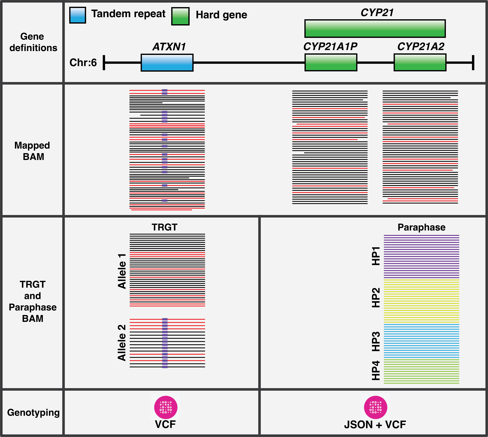

# Output file definitions and descriptions

PTCP generates a comprehensive set of output files for each sample, providing detailed analysis results across multiple analysis domains. The workflow produces files for tandem repeat analysis, gene phasing, structural variant detection, and quality control metrics.

## Table of contents

1. [Output file descriptions](#1-output-file-descriptions)
    - 1.1. [Quality control (ptcp-qc)](#11-quality-control-ptcp-qc)
    - 1.2. [Sample information](#12-sample-information)
    - 1.3. [Reference genome alignment (pbmm2)](#13-reference-genome-alignment-pbmm2)
    - 1.4. [Tandem repeat analysis (TRGT)](#14-tandem-repeat-analysis-trgt)
    - 1.5. [Visualization images](#15-visualization-images)
    - 1.6. [Repeat region analysis](#16-repeat-region-analysis)
    - 1.7. [Gene phasing (Paraphase)](#17-gene-phasing-paraphase)
    - 1.8. [Variant annotation (Havanno)](#18-variant-annotation-havanno)
    - 1.9. [*F8* inversion analysis](#19-f8-inversion-analysis)
    - 1.10. [Structural variant detection (Sawfish)](#110-structural-variant-detection-sawfish)
2. [Output definitions table](#2-output-definitions-table)
3. [Example outputs.json](#3-example-outputsjson)

## 1. Output file descriptions

The following sections provide detailed descriptions of each output type. Some outputs are self-explanatory (such as index files), while others contain analysis results that require more in-depth explanation, this will primarily be in context of sample **HG00281**, with some exceptions to highlight specific outputs.

### 1.1. Quality control (ptcp-qc)

- **`ptcp_qc_reports`** (`Array[File]`): JSON files containing comprehensive quality control metrics for each sample, plus an aggregate report across all samples. These reports include coverage statistics, alignment quality metrics, analysis-specific quality indicators, and expanded analysis on particular characterizations such as *HBA*, *SMN1/2*, and *F8*.
- **`ptcp_qc_csv_reports`** (`Array[File]`): CSV summaries of the ptcp-qc reports, produced after ptcp-qc analysis. When both per-sample and aggregate JSONs are provided, outputs include `qc.trgt.csv`, `qc.paraphase.csv`, `qc.coverage.csv`, and `qc.aggregate.csv`.

The [`ptcp-qc`](https://github.com/PacificBiosciences/ptcp-qc) tool serves as the final integration step in the PTCP workflow, consolidating information from all upstream analyses. It processes outputs from pbmm2 (mapped BAM), TRGT (VCF and spanning BAM), Paraphase (JSON and BAM), *F8* inversion analysis, Sawfish, and optionally *SMN* homology correction to generate comprehensive quality control reports. The ptcp-qc tool automatically processes outputs from all upstream PTCP analyses.

Important: ptcp-qc JSON/CSV outputs are summaries intended for QC triage and reporting. For any surprising or relevant call, validate it in the primary outputs. For example, if `qc.trgt.csv`/`qc.trgt.json` suggests a large tandem repeat expansion at a locus, inspect the corresponding locus record in `trgt_vcf`, review the TRGT allele/waterfall plots, and (when needed) view the `trgt_spanning_bam` in IGV to confirm read support and allele structure.

Some workflows prefer CSV summaries. The PTCP workflow generates these CSVs automatically (available in the PTCP container as `ptcpqc_json_to_csv.py`). The converter auto-detects aggregate vs. per-sample JSONs. Note that coverage-based and duplicate metrics require the aggregate context, so those columns are only populated when `sample_stats` are present in the JSON.

Outputs from TRGT and Paraphase, if provided, are matched to predefined loci in the ptcp-qc targets BED file provided (`ptcp_qc_bed`). Each locus consolidates available reads, genotype calls, and phasing results. Reads are initially categorized based on loci defined in the BED file, with additional special categories for "off-target" and "unmapped" reads. Due to minor extraction differences between tools, some reads initially labeled as "off-target" may be reassigned based on their actual usage by TRGT or Paraphase.

The output from ptcp-qc is organized hierarchically, with top-level grouping by locus (e.g., *GBA*), subdivision by sublocus (e.g., functional gene and pseudogene), then further segmentation based on available TRGT or Paraphase annotations. This structure allows for stratification of reads at multiple granularities. ptcp-qc generates structured JSON reports containing sample metadata (name, genome version, timestamps, tool version), summary statistics (total reads, on-target rates, coverage metrics, sex ratios), locus-specific results with analysis per target locus including coverage and variant information, and quality metrics such as coverage distributions and read quality statistics.

The ptcp-qc output structure reflects the fundamental difference between how TRGT and Paraphase analyze genomic regions. Tandem repeat loci typically represent single genomic regions where all reads from that locus are used for analysis. In contrast, Paraphase loci often have subloci representing functional genes and pseudogenes, where reads from both the functional gene copy and the pseudogene copy are used together for phasing and copy number analysis.

For example, the *ATXN1* locus (analyzed by TRGT) appears as a single entity in the ptcp-qc output, with all reads from that region contributing to the tandem repeat genotyping. Conversely, the *CYP21* locus (analyzed by Paraphase) is organized with subloci for the functional gene (*CYP21A2*) and pseudogene (*CYP21A1P*), where reads from both regions are combined for comprehensive haplotype phasing and copy number determination. The hierarchical organization allows ptcp-qc to provide stratification of reads at multiple granularities, enabling precise quality control and genotyping analysis that respects the analytical approach of each tool.

|  |
| :---: |
| Comparison of ptcp-qc hierarchical organization for TRGT vs Paraphase loci. The mapped BAM contains all reads aligned to the reference genome. For TRGT loci (left), reads from a single genomic region are extracted and analyzed together for tandem repeat genotyping. For Paraphase loci (right), reads from multiple subloci (functional gene and pseudogene) are combined for comprehensive haplotype phasing and copy number analysis.|

The hierarchical structure first reports sample-level statistics, then drills down to individual loci. Each locus can have subgroups (e.g., functional gene vs. pseudogene), and within each subgroup, tool-specific results are reported when available.

Sample-level summary from **HG00281**:

```json
{
  "report_type": "sample",
  "sample_name": "HG00281",
  "genome_version": "hg38",
  "targets_bed": "ptcp-qc.GRCh38.bed",
  "ptcp-qc_version": "1.0.0",
  "stats": {
    "total_reads": 54582,
    "on_target": {
      "total": 7727,
      "hifi": 7049,
      "fail": 678
    },
    "off_target": {
      "total": 46723,
      "hifi": 44398,
      "fail": 2325
    },
    "unmapped": {
      "total": 132,
      "hifi": 31,
      "fail": 101
    },
    "loci": {
      "count": 19,
      "coverages": {
        "stats": {
          "min": 1.0,
          "q1": 1.5,
          "median": 430.0,
          "mean": 406.6842,
          "q3": 660.0,
          "max": 1212.0
        }
      }
    },
    "sex_ratios": {
      "ratio_x_auto": 0.897,
      "ratio_y_auto": 0.018,
      "cov_x": 0.0832,
      "cov_y": 0.0017,
      "baseline_auto": 0.0928
    }
  }
}
```

The locus-level results show the hierarchical organization (abbreviated here). For example, the *GBA* locus has both a functional gene and pseudogene subgroup:

```json
"gba": {
  "group": "gba",
  "reads": {
    "n": 680,
    "hifi": 621,
    "fail": 59,
    "stats": {
      "read_quality": { ... },
      "read_passes": { ... },
      "read_length": { ... }
    }
  },
  "subgroups": {
    "gba_gene_v1": {
      "reads": {
        "n": 319,
        "hifi": 288,
        "fail": 31,
        "stats": { ... }
      }
    },
    "gba_gene_v1_pseudogene": {
      "reads": {
        "n": ...,
        "hifi": ...,
        "fail": ...,
        "stats": { ... }
      }
    }
  },
  "paraphase_results": {
    "gba": {
      "total_reads": 620,
      "unique_reads": 620,
      "total_cn": 4,
      "haplotypes": {
        "gba_hap1": {
          "total_count": 140,
          "unique_count": 140,
          "fractional_count": 140.0
        },
        "gba_hap2": { ... },
        "gba_hap3": { ... },
        "gba_hap4": { ... }
      }
    }
  }
}
```

Paraphase reports several read-count fields at the locus and haplotype level. Because a read can sometimes support multiple haplotypes (for example in highly homologous regions), Paraphase provides three complementary count types per haplotype: **`total_count`**: Total number of read assignments to this haplotype. Reads that support multiple haplotypes are counted once in each supported haplotype. The sum of `total_count` across haplotypes equals `total_reads`. **`unique_count`**: Number of reads uniquely assigned to this haplotype (reads that support only this haplotype). **`fractional_count`**: Effective read support after distributing shared reads fractionally across the haplotypes they support (each shared read contributes `1/N` to each of `N` haplotypes). This value can be non-integer, and the sum of `fractional_count` across haplotypes equals `unique_reads`. When reads are unambiguous (no sharing across haplotypes), `total_count`, `unique_count`, and `fractional_count` will be identical (as in the example above).

Some analysis is gene-specific, for instance the *F8* locus includes inversion detection results with read classification and haplotype information from the *F8* calling method:

```json
"f8inv22": {
  "paraphase_results": {
    "f8inv22": {
      "f8_info": {
        "has_inversion": false,
        "inversion_genotype": "0/0",
        "read_counts": {
          "00": 102,
          "01": 0,
          "10": 0,
          "11": 231,
          "x": 50
        },
        "spans": [
          {
            "inversion_label": "00",
            "haplotype": "f8inv22_hap1",
            "region": "chrX:154878268-154892191",
            "count": 46
          },
          ...
        ]
      }
    }
  }
}
```

When *SMN* homology weights are provided, the additional analysis to correct for potential homology between *SMN1* and *SMN2* is written to the ptcp-qc output. This can correct the Paraphase-reported copy number values for *SMN* by accounting for the high sequence similarity between *SMN1* and *SMN2*, which is necessary whenever there is full homology between *SMN1* and *SMN2*:

```json
"smn1": {
  "paraphase_results": {
    "smn1": {
      ...,
      "smn_info": {
        "smn1_cn": 1,
        "smn2_cn": 3,
        "read_numbers": {
          "smn1": 82,
          "smn2": 211
        },
        ...
      }
    },
    "homology_adjustment": {
      "status": "has_all_loci_for_depth_adjustment",
      "is_possible_homology": false,
      "predicted_coverage_per_copy": 79.1482,
      "success": true,
      "adjusted_smn1_cn": 1,
      "adjusted_smn2_cn": 3,
      "matches_paraphase": true
    }
  }
}
```

The *HBA* locus includes structural variant detection with multiple subgroups and haplotype analysis. Here, ptcp-qc reports structural variants called by both Paraphase and Sawfish, where a `sawfish_results` is added to the *HBA* group as well as a `genotype_adjusted` field in `paraphase_results` to possibly correct the Paraphase-reported genotype based on Sawfish findings.

```json
"hba": {
  "group": "hba",
  "reads": { ... },
  "subgroups": {
    "hba_4.2_3.7": { ... },
    "hba_MEDII_BRIT": { ... },
    "hba_alpha20.5_BRIT": { ... }
  },
  "paraphase_results": {
    "hba": {
      "total_reads": 584,
      "unique_reads": 258,
      "total_cn": 3,
      "genotype": "-a/aa",
      "genotype_adjusted": "-a/aa",
      "sv_calls": {
        "hba_3p7delhap1": "3p7del,chr16:172240-176044"
      },
      "haplotypes": {
        "hba_3p7delhap1": { ... },
        "hba_hba1hap1": { ... },
        "hba_hba2hap1": { ... },
        "hba_homologyhap1": { ... }
      }
    }
  },
  "sawfish_results": {
    "hba": {
      "sv_breakpoints": [
        {
          "chrom": "chr16",
          "start": 172240,
          "end": 176044,
          "length": 3804,
          "svtype": "DEL",
          "genotype": "1/1",
          "allele_depth": [
            1,
            254
          ],
          "annotation": {
            "name": "3p7del",
            "score": 1
          }
        }
      ]
    }
  }
}
```

Since Paraphase does not detect larger structural variants (other than 3p7 and 4p2) in *HBA*, a large deletion like SEA would result in an "aa/aa" genotype call by Paraphase. The adjusted genotype would correctly contain "--/aa" (where "--" represents the deleted alpha-globin gene). For example, if a SEA deletion is detected by Sawfish, you would observe:

```json
"paraphase_results": {
  "hba": {
   ...
    "genotype": "aa/aa",
    "genotype_adjusted": "--/aa",
    "haplotypes": {
     ...
    }
  }
},
"sawfish_results": {
  "hba": {
    "sv_breakpoints": [
      {
        "chrom": "chr16",
        "start": 165396,
        "end": 184700,
        "length": 19304,
        "svtype": "DEL",
        "genotype": "0/1",
        "allele_depth": [
          82,
          186
        ],
        "annotation": {
          "name": "SEA",
          "score": 1
        }
      }
    ]
  }
}
```

### 1.2. Sample information

- **`sample_names`** (`Array[String]`): Contains the sample identifiers in the same order as all other output arrays. This ensures you can correlate outputs with the correct sample.

### 1.3. Reference genome alignment (pbmm2)

- **`mapped_bam`** (`Array[File]`): BAM files containing HiFi (+fail) reads aligned to the reference genome using [pbmm2](https://github.com/PacificBiosciences/pbmm2). These files serve as the foundation for all downstream analyses and contain the primary alignment information for each sample.

- **`mapped_bam_bai`** (`Array[File]`): BAI index files for the mapped BAM files, enabling efficient random access to specific genomic regions during analysis.

### 1.4. Tandem repeat analysis (TRGT)

- **`trgt_vcf`** (`Array[File]`): VCF files containing tandem repeat genotype calls generated by [TRGT](https://github.com/PacificBiosciences/trgt). These files include repeat length estimates, motif sequences, and quality metrics for each targeted repeat region.

The TRGT VCF file provides an analysis-ready summary of each genotyped repeat defined in the input catalog. TRGT outputs complete inferred allele sequences (with a leading padding base for VCF compliance) along with sample-level annotations capturing length, composition, support, purity, and methylation data.

Each genotyped locus contains the following standardized fields:

- INFO fields
  - `TRID` — Unique repeat/locus identifier from the catalog
  - `END` — End coordinate of the locus
  - `MOTIFS` — Comma-separated list of motif units used at this locus
  - `STRUC` — (deprecated) Expected locus structure (e.g., `(TTTTA)n(TTTCA)n(TTTTA)n)`)

- FORMAT fields (per sample)
  - `GT` — Standard genotype
  - `AL` — Allele lengths in base pairs (one value per allele)
  - `ALLR` — Allele length confidence intervals in "low-high" format per allele
  - `SD` — Supporting read depth (read count) per allele
  - `MC` — Motif counts per allele (e.g., `18_0,18_0` when two motifs are listed in MOTIFS)
  - `MS` — Motif spans per allele; encodes run-length segmentation as coordinate blocks within each allele
  - `AP` — Allele purity (fraction of bases matching expected motifs) per allele
  - `AM` — Allele methylation (mean 5mCpG level across the repeat region) per allele

Consider this *AFF2* locus record from sample HG00281:

```
chrX 148500604 . TGCCGCGGCCGCCGCCGCCGCCTGTGCAGCCGCTGCCGCCGCCGCCGCCGCCGCCGCCGCCGCCGCCGCCGCCGCCGCCGCTGCCGCCCCGGCTGCCGCGCCGCGCCGCTGCCTCTGCCCCGGCCGCCCCCGCCGCCGCTGCCGCCGCCG TGCCGCGGCCGCCGCCGCCGCCTGTGCAGCCGCTGCCGCCGCCGCCGCCGCCGCCGCCGCCGCCGCCGCCGCCGCTGCCGCCCCGGCTGCCGCGCCGCGCCGCTGCCTCTGCCCCGGCCGCCCCCGCCGCCGCTGCCGCCGCCG,TGCCGCGGCCGCCGCCGCCGCCTGTGCAGCCGCTGCCGCCGCCGCCGCCGCCGCCGCCGCCGCCGCCGCCGCCGCCGCCGCCGCCGCCGCCGCCGCCGCTGCCGCCCCGGCTGCCGCGCCGCGCCGCTGCCTCTGCCCCGGCCGCCCCCGCCGCCGCTGCCGCCGCCG . . TRID=FRAXE_AFF2;END=148500753;MOTIFS=GCC;STRUC=<TR> GT:AL:ALLR:SD:MC:MS:AP:AM 1/2:143,167:140-149,160-176:302,312:34,42:0(0-3)_0(6-21)_0(27-30)_0(33-72)_0(75-81)_0(87-90)_0(92-95)_0(97-100)_0(103-106)_0(109-112)_0(115-121)_0(124-130)_0(133-142),0(0-3)_0(6-21)_0(27-30)_0(33-96)_0(99-105)_0(111-114)_0(116-119)_0(121-124)_0(127-130)_0(133-136)_0(139-145)_0(148-154)_0(157-166):0.857143,0.877193:0.10,0.76
```

The VCF record spans **chrX:148,500,604–148,500,753** at the locus *FRAXE_AFF2*, which has a repeat motif set of `MOTIFS=GCC`. The genotype is `GT=1/2`, indicating that both alleles are non-reference and correspond to the two alternate haplotypes (the long reference allele is listed as REF but is not carried in this sample).

TRGT reports the following FORMAT fields for the two alleles:

| FORMAT field             | Allele 1           | Allele 2           |
|--------------------------|--------------------|--------------------|
| Allele length (`AL`)     | 143 bp             | 167 bp             |
| Length CI (`ALLR`)       | 140–149 bp         | 160–176 bp         |
| Read support (`SD`)      | 302 reads          | 312 reads          |
| Motif count (`MC`)       | 34 GCC units       | 42 GCC units       |
| Purity score (`AP`)      | 85.7%              | 87.7%              |
| Methylation level (`AM`) | 0.10 (10%)         | 0.76 (76%)         |

The motif counts (`MC=34,42`) correspond to 34 and 42 copies of the GCC unit, which translate to 102 bp and 126 bp of motif sequence. Comparing these values to the total allele lengths shows that both alleles share ~41 bp of non-motif sequence, while the longer allele carries eight additional GCC repeats (24 bp), explaining the difference between 143 and 167 bp. The segmentation string (`MS`) makes this structure explicit, with each block (e.g. 0(33-72)) marking a run of GCC units and gaps corresponding to interruptions or non-motif sequence. The purity values (`AP=0.857,0.877`) indicate that roughly 86–88% of each allele consists of motif sequence, consistent with clean, motif-rich repeats. Methylation levels (`AM=0.10,0.76`) show that the shorter allele is largely unmethylated, whereas the longer expanded allele is heavily methylated. *AFF2* in HG00281 is heterozygous for two non-reference alleles that differ by eight GCC copies, share the same amount of non-motif sequence, and show contrasting epigenetic signatures.

- **`trgt_spanning_bam`** (`Array[File]`): BAM files containing reads that span across tandem repeat regions.

The TRGT *spanning BAM* contains only the reads used for genotyping at each targeted locus, trimmed to the repeat plus ~50 bp of flanking sequence (default). These BAMs are intended for close inspection (e.g., in IGV) and for downstream tooling such as TRGT plotting. Unlike the raw *repeat_reads* BAM, they carry per-read annotations that link each read back to the locus and allele inferred by TRGT. Among these are the `TR` tag, which identifies the locus, and the `AL` tag, which records the allele assignment (`0` for the shorter allele, `1` for the longer).  Note that, `trgt_spanning_bam` is always a strict subset of reads from either `reads_overlapping_repeats` or the original `mapped_bam`, filtered down to those that fully span the locus. Note that because each read is tagged with its corresponding tandem repeat locus tag (`TR`) it is straightforward to filter the BAM file for specific reads using the tag.

As an example, consider the two reads below from the *AFF2* locus in HG00281, which correspond to alleles 0 and 1, respectively:

```sam
m84036_250311_030304_s2/266931111/ccs 0 chrX 148500554 60 21=1D62=9D157= chr1 1 0 CTTCTAGCTGTCCAGGCTCCGCCCCTGTGAGTGTGTAAGTGTGTGATGCTGCCGCGGCCGCCGCCGCCGCCTGTGCAGCCGCTGCCGCCGCCGCCGCCGCCGCCGCCGCCGCCGCCGCCGCTGCCGCCCCGGCTGCCGCGCCGCGCCGCTGCCTCTGCCCCGGCCGCCCCCGCCGCCGCTGCCGCCGCCGGCCCGCAGCCAGCCAGGCGGGCGGCCCAGCCCGCCTGAGCCCGCAGCGGC IIIIIIIIIIIIIIIIIIIIIIIIIIIIIIIIIIIIIIIIIIIIIIIIIIIIIIIIIIIIIIIIIIIIIIIIIIIIIIIIIIIIIIIIIIIIIIIIIIIIIIIIIIIIIIIIIIIIIIIIIIIIIIIIIIIIIIIIIIIIIIIIIIIIIIIIIIIIIDIIIIIIIIIIIIIIIIIIIIIIIIIIIIIIIIIIIIIIIIIIIIIIIIIIIIIIIIIIIIIIIIIIIIIIIIIIIIIIIIII TR:Z:FRAXE_AFF2 rq:f:0.999924 MC:B:C,0,0,0,0,0,0,0,0,0,0,0,0,0,0,0,0,0,0,0,0,0,0,0,0,0,0,0,0,0,0,0,0,0,0,0,0,0,0,0,0,0 MO:B:i,-959,-655,1684 SO:i:-1880 EO:i:1975 AL:i:0 FL:B:I,50,50

m84036_250311_030304_s2/236786469/ccs 0 chrX 148500554 60 21=1D62=18I166= chr1 1 0 CTTCTAGCTGTCCAGGCTCCGCCCCTGTGAGTGTGTAAGTGTGTGATGCTGCCGCGGCCGCCGCCGCCGCCTGTGCAGCCGCTGCCGCCGCCGCCGCCGCCGCCGCCGCCGCCGCCGCCGCCGCCGCCGCCGCCGCCGCCGCCGCCGCTGCCGCCCCGGCTGCCGCGCCGCGCCGCTGCCTCTGCCCCGGCCGCCCCCGCCGCCGCTGCCGCCGCCGGCCCGCAGCCAGCCAGGCGGGCGGCCCAGCCCGCCTGAGCCCGCAGCGGC IIIIIIIIIIIDIIIIIIIII+IIIIIIIIIIIIIIIIIIIIIIIIIIIIIIIIIIIIIIIIIIIIIIIIIIIIIIIIIIIIIIIII<IIIIIDIIDII<IIDIIIIIIIIDIDIIIIIIIIIIIIIIIIIIIIIIIIIIIIIIDIIIIIIIIDIIIIIIIIDIIIIDIIIIDIIIIIIIIIIIIIII7IIII+IIIIIIIIIIIIIIIIIIIDDIDIIIIIIIIDIIIIIIIIIDIIIIIIIIIIIIIIIIIIII+IIIIIIIDII TR:Z:FRAXE_AFF2 rq:f:0.999666 MC:B:C,255,255,255,254,250,251,202,123,120,246,252,240,165,213,244,244,245,253,255,255,255,255,255,255,253,251,249,252,252,250,234,220,234,254,196,53,42,209,206,209,200,244,255,255,255,255,255,254,254,237 MO:B:i,-1673,-1094,-1055,-876,1684 SO:i:-1880 EO:i:1975 AL:i:1 FL:B:I,50,50
```

Each SAM record in a spanning BAM follows the standard SAM format, but includes additional TRGT- and PacBio-specific tags:

- **SAM fields:** QNAME/FLAG/RNAME/POS/MAPQ/CIGAR/SEQ/QUAL—interpret as usual, see the [SAM specification](https://samtools.github.io/hts-specs/) for more details.
- **Tags of interest:**  
  `TR:Z` — Unique repeat/locus identifier from the catalog
  `AL:i` — Allele assignment (0 = short, 1 = long; haploid loci may only have 0)
  `SO:i` — Start offset of the read relative to the locus start (negative = upstream of locus start)
  `EO:i` — End offset of the read relative to the locus end (positive = downstream of locus end)
  `MO:B:i` — Mismatch offsets upstream or downstream relative to the locus (useful for spotting mismatches)
  `FL:B:I` — Left/right flank lengths included with the repeat (typically 50,50 by default)
  `MC:B:C` — Methylation encoding
  `rq:f` — Predicted read accuracy

### 1.5. Visualization images

The primary use case for the spanning BAM is visualization and QC. You can either use it with TRGT’s plotting tool to generate allele and waterfall plots with motif or methylation coloring, or load it into IGV to inspect allele assignments, interruptions, and per-allele methylation patterns. For example, loading the spanning BAM of HG00281 and viewing *AFF2* reveals one contracted and one expanded allele relative to the reference genome:

|  |
|:--:|
| IGV view of the *AFF2* locus in HG00281 (downsampled coverage). Reads are grouped and colored by allele (`AL` tag), showing a contracted allele (top) and an expanded allele (bottom) relative to the reference. |

To make IGV interpretation easier, group reads by allele: right-click the BAM track → Group alignments by → Tag… → enter `AL`. The two alleles then render as separate stacks, mirroring TRGT’s allele panels. You can also color by allele using the same menu: Color alignments by → Tag… → `AL`.

- **`trgt_spanning_bam_bai`** (`Array[File]`): Index files for the TRGT spanning BAM files.

- **`reads_overlapping_repeats`** (`Array[File]`): BAM files containing all reads that intersect the targeted tandem repeat regions, regardless of whether they fully span the locus. In contrast to the `trgt_spanning_bam` files, which include only the trimmed, locus-spanning reads used directly for genotyping, these overlapping BAMs capture every read touching a repeat region. They are useful for repeated analysis, QC, or custom downstream processing, and can be loaded into IGV when you want to inspect the broader context around a repeat rather than just the spanning reads.

- **`reads_overlapping_repeats_bai`** (`Array[File]`): Index files for the reads overlapping repeats BAM files.

- **`images_motifs_allele`** (`Array[File]`): ZIP archives containing per-locus visualizations showing motifs for each allele. These images help visualize the structure and composition of tandem repeats.

- **`images_meth_allele`** (`Array[File]`): ZIP archives containing per-locus visualization images for each allele with methylation shown, providing insights into epigenetic modifications within repeat regions.

- **`images_motifs_waterfall`** (`Array[File]`): ZIP archives containing waterfall plot visualizations showing motif patterns.

- **`images_meth_waterfall`** (`Array[File]`): ZIP archives containing waterfall plot visualizations showing methylation patterns.

### 1.6. Repeat region analysis

TRGT generates two distinct visualizations of tandem repeats: allele plots and waterfall plots. Each of these can be rendered either in a motif-centric view, where repeat units are highlighted, or in a methylation-aware view, where CpG sites are annotated with their methylation levels. Allele plots align reads directly to the consensus allele sequences and emphasize insertions, deletions, and substitutions relative to the repeat. Waterfall plots, in contrast, forego alignment and instead display the repeat-spanning segments of reads in their native orientation, making it easier to recognize heterogeneity and mosaicism. Options such as `--squished` allow the plots to be compacted for targeted datasets with very high coverage, and `--max-allele-reads` limits the number of displayed reads per allele to ensure clarity when coverage is excessive.

For the *FMR1* locus in HG00281, we show all four plot types: allele versus waterfall, each shown in both motif and methylation modes. The complete set highlights the different perspectives each visualization offers: the motif-based views reveal repeat organization and structure, while the methylation views capture epigenetic differences across alleles. In this case, the long expanded allele is clearly methylated, whereas the shorter allele shows little to no methylation signal:

|  |
|:--:|
| Different styles of TRGT plots for *FMR1* in HG00281. The options `--squished` and `--max-allele-reads 20` were used to conserve space, compressing the plots and limiting each allele to 20 reads. |

For additional details about the available plotting options and interpretation guidelines, see the [Interpreting TRGT plots](https://github.com/PacificBiosciences/trgt/blob/main/docs/trvz-plots.md) section in the TRGT repository.

### 1.7. Gene phasing (Paraphase)

- **`paraphase_bam`** (`Array[File]`): BAM files containing haplotype-assigned reads, all aligned to the main gene of each family (paralog reads are projected/lifted into this space).

A coordinate-sorted BAM in which all reads for a gene family are aligned against the main gene (e.g., *SMN1* for the *SMN* family). Reads originating from paralogs (e.g., *SMN2*) are projected into the main gene’s coordinate space so that coverage, variants, and haplotypes are directly comparable. Inside these BAMs you will find the usual alignment fields, but also additional tags: the `RN` tag denotes the gene family name such as `smn1` and the `HP` tag identifies the haplotype, e.g., `smn1_smn1hap1`, which corresponds to haplotype 1 of *SMN1*.

For HG00281, loading the Paraphase BAM for the *SMN* family into IGV and coloring and grouping reads by the HP tag reveals four distinct haplotypes:

|  |
|:--:|
| IGV view of the Paraphase-phased BAM for the *SMN* family in this sample. Four haplotypes are visible: one copy of *SMN1* and three copies of *SMN2*. Distinct SNPs and indels mark each haplotype, confirming the consistency of phasing. |

One of these haplotypes corresponds to *SMN1*, while the other three correspond to *SMN2*, which indicates that the sample carries one copy of *SMN1* and three copies of *SMN2* (note: always refer to the `paraphase_json` to confirm this!). Each haplotype shows a characteristic combination of SNPs and indels that distinguish it from the others. These variant patterns act as fingerprints, making it straightforward to check the consistency of phasing: reads assigned to the same haplotype consistently carry the same set of variants, while differences across haplotypes separate the *SMN1* copy from the three *SMN2* copies. This provides both copy number resolution and strong evidence for accurate phasing.

- **`paraphase_bam_bai`** (`Array[File]`): Index files for the Paraphase BAM files.

- **`paraphase_json`** (`Array[File]`): Structured summaries of haplotypes, copy number, and variant sets per gene family and sample

- **`paraphase_vcfs`** (`Array[Array[File]]`): VCF files containing small variant calls, with one VCF file generated for each targeted region (gene family).

### 1.8. Variant annotation (Havanno)

- **`havanno_json`** (`Array[File?]`): JSON files that annotate Paraphase output with variants of interest. These files provide additional context for detected variants, e.g., annotating the number of pathogenic or pseudogene-specific variants on a haplotype.

### 1.9. *F8* inversion analysis

- **`f8_vcf`** (`Array[File]`): VCF files containing *F8* inversion calls on intron 1 and intron 22.

- **`f8_json`** (`Array[File]`): JSON files containing detailed evidence supporting *F8* inversion calls, including supporting read information, spans, and confidence metrics.

### 1.10. Structural variant detection (Sawfish)

- **`sawfish_minimap2_bam`** (`Array[File]`): BAM files containing reads aligned with minimap2 specifically for Sawfish analysis. These files focus on a window around the *HBA* region and the alignment is optimized for structural variant detection.

- **`sawfish_minimap2_bam_bai`** (`Array[File]`): Index files for the Sawfish minimap2 BAM files.

- **`sawfish_vcf`** (`Array[File]`): VCF files containing structural variant calls detected by Sawfish.

- **`sawfish_vcf_tbi`** (`Array[File]`): Index files for the Sawfish VCF files.

## 2. Output definitions table

| Name                            | Type                 | Description                                                                                          | Notes                                                                              |
| ------------------------------- | -------------------- | ---------------------------------------------------------------------------------------------------- | ---------------------------------------------------------------------------------- |
| `sample_names`                  | `Array[String]`      | Sample names, in the same order as other arrays                                                          |                                                                                    |
| `mapped_bam`                    | `Array[File]`        | BAM with reference genome alignments                                                                 | [details](https://github.com/PacificBiosciences/pbmm2)                             |
| `mapped_bam_bai`                | `Array[File]`        | Index for above                                                                                      |                                                                                    |
| `trgt_vcf`                      | `Array[File]`        | VCF of tandem repeat genotypes                                                                       | [details](https://github.com/PacificBiosciences/trgt/blob/main/docs/vcf_files.md)  |
| `trgt_spanning_bam`             | `Array[File]`        | BAM of clipped spanning reads overlapping repeat regions                                             |                                                                                    |
| `trgt_spanning_bam_bai`         | `Array[File]`        | Index for above                                                                                      |                                                                                    |
| `images_motifs_allele`          | `Array[File]`        | Zip of per-region images                                                                             | [details](https://github.com/PacificBiosciences/trgt/blob/main/docs/trvz-plots.md) |
| `images_meth_allele`            | `Array[File]`        | Zip of per-region images                                                                             | [details](https://github.com/PacificBiosciences/trgt/blob/main/docs/trvz-plots.md) |
| `images_motifs_waterfall`       | `Array[File]`        | Zip of per-region images                                                                             | [details](https://github.com/PacificBiosciences/trgt/blob/main/docs/trvz-plots.md) |
| `images_meth_waterfall`         | `Array[File]`        | Zip of per-region images                                                                             | [details](https://github.com/PacificBiosciences/trgt/blob/main/docs/trvz-plots.md) |
| `reads_overlapping_repeats`     | `Array[File]`        | BAM of reads overlapping repeat regions                                                              |                                                                                    |
| `reads_overlapping_repeats_bai` | `Array[File]`        | Index for above                                                                                      |                                                                                    |
| `paraphase_bam`                 | `Array[File]`        | BAM of reads phased by Paraphase, all haplotypes are aligned against the main gene of interest       |                                                                                    |
| `paraphase_bam_bai`             | `Array[File]`        | Index for above                                                                                      |                                                                                    |
| `paraphase_json`                | `Array[File]`        | JSON that summarizes haplotypes and variant calls for each gene family in each sample                |                                                                                    |
| `paraphase_vcfs`                | `Array[Array[File]]` | VCFs of small variants, a VCF file is written for each region (gene family)                          | [details](https://github.com/PacificBiosciences/paraphase/blob/main/docs/vcf.md)   |
| `havanno_json`                  | `Array[File?]`       | JSON file annotating Paraphase output with variants of interest                                      | [details](../docker/ptcp/scripts/havanno/README.md)                                |
| `f8_vcf`                        | `Array[File]`        | VCF of *F8* inversion calls                                                                          |                                                                                    |
| `f8_json`                       | `Array[File]`        | JSON of evidence for *F8* inversion calls                                                            |                                                                                    |
| `sawfish_minimap2_bam`          | `Array[File]`        | BAM of reads aligned with minimap2 used by Sawfish (this only includes reads in ~80kb window on *HBA*) |                                                                                  |
| `sawfish_minimap2_bam_bai`      | `Array[File]`        | Index for above                                                                                      |                                                                                    |
| `sawfish_vcf`                   | `Array[File]`        | VCF of SVs called by Sawfish                                                                         |                                                                                    |
| `sawfish_vcf_tbi`               | `Array[File]`        | Index for above                                                                                      |                                                                                    |
| `ptcp_qc_reports`               | `Array[File]`        | JSONs of ptcp-qc per sample and aggregate reports                                                    |                                                                                    |

## 3. Example outputs.json

Here's an example of what the workflow outputs look like for the Coriell sample **HG00281**:

```json
{
  "ptcp.sample_names": ["HG00281"],
  "ptcp.mapped_bam": ["ptcp/out/HG00281.mapped.bam"],
  "ptcp.mapped_bam_bai": ["ptcp/out/HG00281.mapped.bam.bai"],
  "ptcp.trgt_vcf": ["ptcp/out/HG00281.trgt.vcf"],
  "ptcp.trgt_spanning_bam": ["ptcp/out/HG00281.trgt.sorted.spanning.bam"],
  "ptcp.trgt_spanning_bam_bai": ["ptcp/out/HG00281.trgt.sorted.spanning.bam.bai"],
  "ptcp.images_meth_allele": ["ptcp/out/HG00281.meth_allele.trgt_plots.zip"],
  "ptcp.images_meth_waterfall": ["ptcp/out/HG00281.meth_waterfall.trgt_plots.zip"],
  "ptcp.images_motifs_allele": ["ptcp/out/HG00281.motifs_allele.trgt_plots.zip"],
  "ptcp.images_motifs_waterfall": ["ptcp/out/HG00281.motifs_waterfall.trgt_plots.zip"],
  "ptcp.reads_overlapping_repeats": ["ptcp/out/HG00281.repeats.bam"],
  "ptcp.reads_overlapping_repeats_bai": ["ptcp/out/HG00281.repeats.bam.bai"],
  "ptcp.paraphase_bam": ["ptcp/out/HG00281_paraphase/HG00281.paraphase.bam"],
  "ptcp.paraphase_bam_bai": ["ptcp/out/HG00281_paraphase/HG00281.paraphase.bam.bai"],
  "ptcp.paraphase_json": ["ptcp/out/HG00281_paraphase/HG00281.paraphase.json"],
  "ptcp.paraphase_vcfs": [
    [
      "ptcp/out/HG00281_paraphase/HG00281_paraphase_vcfs/HG00281_cyp21.vcf",
      "ptcp/out/HG00281_paraphase/HG00281_paraphase_vcfs/HG00281_f8inv1.vcf",
      "ptcp/out/HG00281_paraphase/HG00281_paraphase_vcfs/HG00281_f8inv22.vcf",
      "ptcp/out/HG00281_paraphase/HG00281_paraphase_vcfs/HG00281_gba.vcf",
      "ptcp/out/HG00281_paraphase/HG00281_paraphase_vcfs/HG00281_hba.vcf",
      "ptcp/out/HG00281_paraphase/HG00281_paraphase_vcfs/HG00281_hbb.vcf",
      "ptcp/out/HG00281_paraphase/HG00281_paraphase_vcfs/HG00281_rpgr.vcf",
      "ptcp/out/HG00281_paraphase/HG00281_paraphase_vcfs/HG00281_smn1.vcf"
    ]
  ],
  "ptcp.havanno_json": ["ptcp/out/HG00281.havanno.json"],
  "ptcp.f8_json": ["ptcp/out/HG00281.f8inversion.json"],
  "ptcp.f8_vcf": ["ptcp/out/HG00281.f8inversion.vcf"],
  "ptcp.sawfish_minimap2_bam": ["ptcp/out/HG00281.minimap2.bam"],
  "ptcp.sawfish_minimap2_bam_bai": ["ptcp/out/HG00281.minimap2.bam.bai"],
  "ptcp.sawfish_vcf": ["ptcp/out/HG00281_sawfish/HG00281.sv.vcf.gz"],
  "ptcp.sawfish_vcf_tbi": ["ptcp/out/HG00281_sawfish/HG00281.sv.vcf.gz.tbi"],
  "ptcp.ptcp_qc_reports": ["ptcp/out/ptcp_qc/qc.HG00281.json", "ptcp/out/ptcp_qc/qc.aggregate.json"],
  "ptcp.ptcp_qc_csv_reports": [
    "ptcp/out/ptcp_qc/qc.trgt.csv",
    "ptcp/out/ptcp_qc/qc.paraphase.csv",
    "ptcp/out/ptcp_qc/qc.coverage.csv",
    "ptcp/out/ptcp_qc/qc.aggregate.csv"
  ]
}
```
