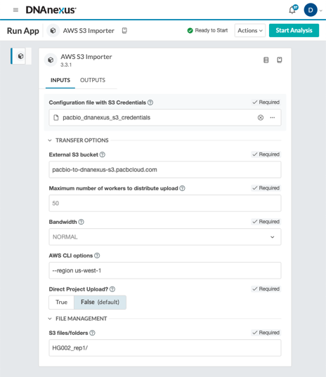

# PacBio PureTarget Carrier Pipeline (PTCP) on DNAnexus

The PacBio PureTarget Carrier Pipeline is a WDL-based workflow designed to genotype tandem repeat regions and homologous genes with segmental duplications using PacBio PureTarget HiFi data. As all software dependencies are baked into the Docker images referenced by the WDL and executed natively on the [DNAnexus](https://www.dnanexus.com/) platform, no local installation is required.

## Quick start

If you just want to try the pipeline, skip to [2.2 Setting up a PTCP workflow](#22-setting-up-a-ptcp-workflow), and you can try running the pipeline with example data that are already available on the platform.

## Table of Contents

1. [Transferring data to DNAnexus](#1-transferring-data-to-dnanexus)
    - 1.1. [Import from AWS S3](#11-transferring-data-from-your-s3-bucket-to-dnanexus)
    - 1.2. [Upload Agent](#12-transferring-data-to-dnanexus-via-upload-agent)
2. [Running PTCP](#2-running-ptcp)
    - 2.1. [Inputs](#21-inputs)
    - 2.2. [Setting up a PTCP workflow](#22-setting-up-a-ptcp-workflow)
    - 2.3. [Outputs](#23-outputs)
    - 2.4. [Example data](#24-example-data)
3. [Monitoring jobs](#3-monitoring-jobs)
4. [Transferring data from DNAnexus](#4-transferring-data-from-dnanexus)
5. [PTCP versioning in DNAnexus](#5-ptcp-versioning-in-dnanexus)
6. [Support](#6-support)

**Note:** Example data is available on DNAnexus already to test running PTCP. If you do not have data to upload and run now, you can skip ahead to the [Running PTCP](#2-running-ptcp) section.

___

## 1. Transferring data to DNAnexus

Uploading data to DNAnexus can be achieved in two ways:

1. Transferring the data from your S3 bucket to DNAnexus via the web interface "AWS S3 Importer" workflow
2. Using the DNAnexus Upload Agent via the command-line

### 1.1. Transferring data from your S3 bucket to DNAnexus

If your data are in an AWS S3 bucket it is easy to transfer directly from that bucket to DNAnexus via the web interface. To do this:

1. Log in to DNAnexus and go to your Project
2. Click **Start Analysis** in the upper-right corner
3. Select **AWS S3 Importer**
4. Give your import job a name and select where you would like your data to be uploaded on DNAnexus
5. Fill in the configuration page. An example is shown below:



6. If this is your first time transferring from this bucket, you will need to upload a **Configuration file with S3 Credentials**. This is a text file containing your S3 bucket key and secret access key. An example is shown below. Note the name of the profile is "default":

```bash
[default]
aws_access_key_id = KYINF..KPfake
aws_secret_access_key = l1fde...se2k1infofake
```

7. Click "Start Analysis"

### 1.2. Transferring data to DNAnexus via Upload Agent

The Upload Agent is a convenient way to transfer data from your institution to DNAnexus via the command-line, especially when you have a lot of files to transfer (e.g., a PacBio run folder). Instructions for setting up and using Upload Agent can be found on [DNAnexus's Documentation page](https://documentation.dnanexus.com/user/objects/uploading-and-downloading-files/batch/upload-agent).

___

## 2. Running PTCP

This section explains how to configure and execute the PTCP workflow on DNAnexus, including the required inputs, step-by-step setup, expected outputs, and available example data.

### 2.1. Inputs

| Name           | Type         | Description |
|----------------|--------------|-------------|
| Fail reads     | File chooser | The Fail read BAM files corresponding to the samples you want to analyze |
| HiFi reads     | File chooser | The HiFi read BAM files corresponding to the samples you want to analyze   |
| Sample sheet   | File chooser | A CSV of sample information corresponding to the HiFi and fail reads you selected for analysis. For details on formatting the sample sheet, refer to the [sample sheet section of the Input Files documentation](./Input_files.md#12-sample-sheet). |

"Fail" reads should always be included if you have them, but inputting "fail" reads in DNAnexus is optional. For example, if you have already merged your "fail" reads into your HiFi reads BAM file, then you would only need to input the "HiFi" reads.

### 2.2. Setting up a PTCP workflow

Even if you do not have your own PacBio data to run the PTCP workflow in DNAnexus, there is example data on the platform available for you to try running the pipeline. Below we will go over the steps to set up and run a pipeline using example data.

1. Click **Start Analysis**
2. Select the "PacBio PureTarget Carrier Pipeline (AWS US East)" workflow and click **Run Selected**
    - Note: If your project is in a different AWS region you will see your region in the workflow name, e.g. AWS EU Frankfurt
3. Give this run a name and select a folder where you want the outputs to be written to
4. For each sample you want to run you will need to select that sample's "HiFi reads" and "fail reads" in the configuration page
    1. Click **Fail reads** and select each of the fail read BAM files that correspond to the samples you want to analyze
    2. Click **HiFi reads** and select each of the HiFi read BAM files that correspond to the samples you want to analyze
    3. Fail reads are optional; if you include them, select the fail-read BAMs corresponding to the samples you're running
5. Select your **Sample sheet** that corresponds to the samples you want to analyze. These samples should match the HiFi and fail read BAMs you selected in the previous step
6. Click **Start Analysis**

### 2.3. Outputs

Outputs will be written to the output folder you selected when setting up the pipeline. There will be several output files written for each sample. Below is an example of output files for a sample called `bc2048` with annotations of what that output file contains:

```bash
bc2048.mapped.bam         <- pbmm2 mapped reads
bc2048.mapped.bam.bai
bc2048.repeats.bam        <- pbmm2 mapped reads intersecting the repeats defined in the TRGT BED
bc2048.repeats.bam.bai
bc2048.trgt.sorted.spanning.bam        <- TRGT BAM with spanning reads
bc2048.trgt.sorted.spanning.bam.bai
bc2048.trgt.vcf                        <- Tandem repeat genotypes generated by TRGT
bc2048.meth_allele.trgt_plots.zip      <- Tandem repeat plots generated by TRGT
bc2048.meth_waterfall.trgt_plots.zip   <- ...
bc2048.motifs_allele.trgt_plots.zip    <- ...
bc2048.motifs_waterfall.trgt_plots.zip <- ...
bc2048.f8inversion.json    <- F8 inversion calls with extended information
bc2048.f8inversion.vcf     <- F8 inversion calls
bc2048.paraphase.bam       <- Paraphase re-aligned BAM with annotations
bc2048.paraphase.bam.bai
bc2048.paraphase.json      <- Paraphase results per target region
bc2048_cyp21.vcf           <- Paraphase VCF with small variant calls per target per haplotype  
bc2048_f8inv1.vcf          <- ...
bc2048_f8inv22.vcf         <- ...
bc2048_gba.vcf             <- ...
bc2048_hba.vcf             <- ...
bc2048_hbb.vcf             <- ...
bc2048_rpgr.vcf            <- ...
bc2048_smn1.vcf            <- ...
bc2048.havanno.json     <- Annotated small variants called by Paraphase from the VCF folder,
                           these are annotated given a user defined variant list
bc2048.minimap2.bam        <- minimap2-remapped reads used by Sawfish (HBA region)
bc2048.minimap2.bam.bai
bc2048_sawfish/bc2048.sv.vcf.gz       <- Sawfish SV calls (HBA region)
bc2048_sawfish/bc2048.sv.vcf.gz.tbi
ptcp_qc/qc.bc2048.json     <- ptcp-qc per-sample QC report (path/naming may vary by platform)
```

### 2.4. Example data

Example data to run PTCP in DNAnexus can be found in two projects (depending on your AWS region):

- PacBio PureTarget - Sample Data (AWS US East)
- PacBio PureTarget - Sample Data (AWS EU Frankfurt)

In either project, you will find the example data in the `Coriell-final-panel-hifi-fail-reads` folder. The fail_reads, hifi_reads, and two example sample sheets are maintained here.

___

## 3. Monitoring jobs

Once a pipeline is submitted, you can monitor its progress on the Monitor page. Here, you will see all jobs you have submitted in the past, as well as jobs that are currently running. Once a job completes, you will see how long it took to run (under **Duration**) and the total cost of the job (under **Cost**). Clicking on a specific job will take you to the job's page, where you can view more detailed information about the input files used and the resulting output files.

___

## 4. Transferring data from DNAnexus

Transferring data from DNAnexus to your S3 bucket or file system is similar to the process of uploading data. You can either:

- Use the **AWS S3 Exporter** workflow to copy data from DNAnexus to your S3 bucket, or
- Use the [DNAnexus Download Agent](https://github.com/dnanexus/dxda) to download data directly to your file system.

___

## 5. PTCP versioning in DNAnexus

PTCP will be updated periodically in DNAnexus. For reproducibility, it is important to ensure that you are using the same version of the pipeline throughout your experiment. You can view the pipeline version used on the **Monitor** page by clicking on the executable in the **Info** side pane. When setting up a new pipeline, click the drop-down menu next to the **PacBio PureTarget Carrier Pipeline** workflow and select the version you would like to use.

___

## 6. Support

If you have questions or issues running PTCP on DNAnexus, you can contact PacBio support at [support@pacb.com](mailto:support@pacb.com?subject=DNAnexus%20PureTarget%20Carrier%20Pipeline). Please make sure **DNAnexus PureTarget Carrier Pipeline** is in the subject.
